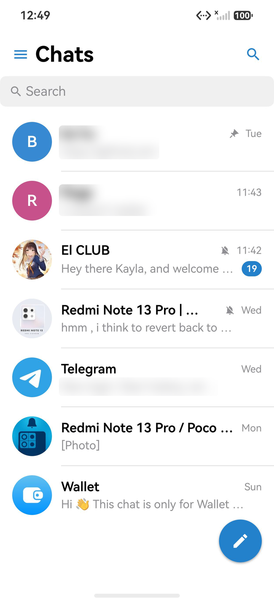
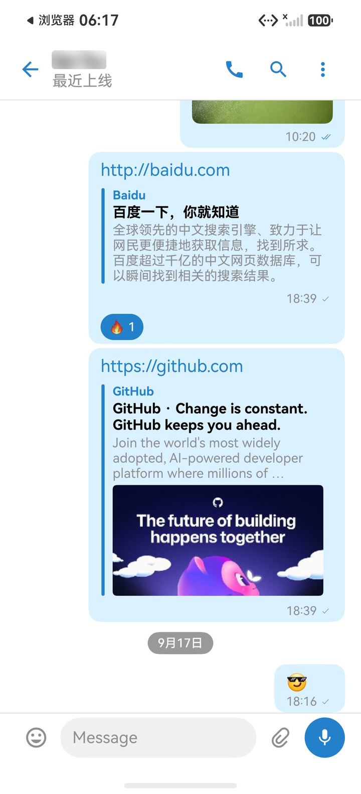
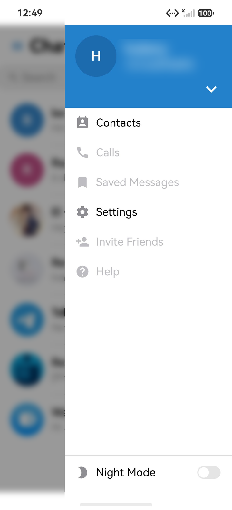
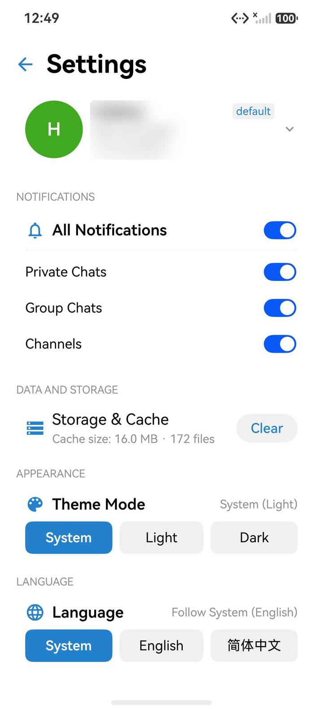

# Telegram X · HarmonyOS NEXT 跨平台架构研究

> **ArkUI / Native C++ / NDK 跨平台架构与图形渲染的技术研究与可行性验证项目**

本项目是一次**架构级的技术研究与可行性验证（Feasibility Study & Architecture Research）**，研究命题是：

> 一套体量可观、依赖底层 C++ 网络核心、且对渲染性能敏感的开源 Android 即时通讯客户端架构，
> 能否在 **HarmonyOS NEXT（纯血鸿蒙）** 上以 **ArkTS / ArkUI 声明式 UI + Native C++ / NDK + Node-API 桥接** 的技术路线完成等价重建？

项目产出物是**架构方法论、分层范式、桥接实现、CI 门禁体系与可复现的验证数据集**——而不是一个面向消费者分发的成品软件。本项目**不开设任何收费渠道、不接受任何形式的捐赠或赞助、不进行任何营利活动、不代表任何组织**，是一个纯技术导向的去中心化开源项目。

上游参照的开源实现为 [Telegram X](https://github.com/TGX-Android/Telegram-X)（GPLv3）。本项目**不包含任何 Android 代码**：UI、导航、状态管理、系统能力全部基于 ArkTS / ArkUI 从零重写；通信协议核心复用 [TDLib](https://core.telegram.org/tdlib)（C++）并以 HarmonyOS NDK 交叉编译；两者之间通过 **Node-API 窄接口**连接。上游 Android 实现仅作为**行为参考、差分测试基准（oracle）与资源来源**。

> ⚠️ 本项目是社区驱动的非官方研究项目，与 Telegram、Telegram X（TGX-Android）团队及华为均无隶属关系。Telegram 是 Telegram FZ-LLC 的注册商标。本项目不分发预编译安装包，不运营任何服务端，不提供任何商业支持。

---

## 一、研究定位：本项目研究什么，不研究什么

### 1.1 三个核心研究命题

| # | 研究命题 | 验证方式与产出 |
|---|---|---|
| **R1** | **ArkUI 声明式渲染体系对复杂客户端 UI 的承载能力** —— 大数据量增量更新列表、逐字符富文本排版、内联媒体/贴纸/反应条等混合布局，在 ArkUI 上的渲染性能、内存占用与增量刷新正确性 | 真机几何/布局树取证（`uitest dumpLayout`）、逐像素回归比对、LazyForEach 差分算法与行签名一致性单测 |
| **R2** | **Native C++ / NDK 交叉编译与 Node-API 窄桥接的工程可行性** —— 含跨语言异步事件的有序性、回调重入安全、线程/TSFN 生命周期、会话代际隔离 | TDLib 1.8.67 经 NDK 交叉编译跑在真机上；桥接层「回调内退订/重入/跨代陈旧事件丢弃」专项单测 |
| **R3** | **平台能力抽象（Ports & Adapters）与分层依赖治理** —— 如何把 Push、媒体、相机、存储、密钥库等系统能力收敛到纯接口，使领域层与业务层对系统 Kit **零依赖**，并用静态分析强制约束 | `check_architecture.py` 全量扫描 + `core/*`、`feature/*/reducer` 的 100% Kit-free 断言（CI 门禁强制） |

### 1.2 本项目**不涉及**的研究方向

除静态资源与上游许可文本外，本项目**不研究、不实现、不引入**以下任何内容，仓库中亦不存在相关代码或配置：

- ❌ 代理客户端（HTTP / SOCKS5 / Shadowsocks / Trojan / VLESS / VMess / WireGuard 等）
- ❌ 硬编码中继节点、中转服务器、订阅链接或任何形式的节点配置
- ❌ 流量伪装、协议混淆、TLS 指纹伪造、域名前置等**规避网络监管**的实现
- ❌ 读取或改写系统代理 / VPN 配置，或申请、使用任何 VPN 类系统能力
- ❌ 服务端实现、节点分发、订阅售卖、激活码、授权校验等任何商业化载荷
- ❌ 任何形式的收款、打赏、捐赠入口与私人社交联系方式

---

## 二、网络通信模块说明与合规定位

> 本节为项目的**合规红线声明**，与代码实现一一对应，可被审计验证。

### 2.1 定位

本项目的网络通信部分**只是一个纯客户端协议栈的接口层适配（client-side protocol stack binding / interface adaptation layer）**。它的全部职责是：

1. 把上游 C++ 协议核心（TDLib）经 HarmonyOS NDK 交叉编译为动态库（`libtdjson.so`）；
2. 经 Node-API 桥（`libtdcore_napi.so`）建立**单向窄接口**：上层只发结构化请求、只收结构化事件；
3. 在 ArkTS 侧生成本地强类型 DTO / Codec，完成请求封装与事件反序列化；
4. 维护「请求 → 事件 → 状态投影」的有序性与会话隔离。

**它不决定数据包往哪里走，也不改变数据包的形态。** 连接的建立、协商、加密与路由完全由上游协议核心按其既有语义完成，本项目未对其做过任何与路由/转发语义相关的行为改动。

### 2.2 明确不包含的网络机制（可审计）

| 项 | 状态 | 审计依据 |
|---|---|---|
| 内置代理（HTTP / SOCKS5 / Shadowsocks 等） | **不存在** | 应用/网关/领域/业务层无任何 `addProxy` / `editProxy` / `ProxyType` 调用点；`core/td_api_generated` 中的 `proxyType*` 仅为上游协议 IDL 的**自动生成类型**，仓库内无调用方 |
| 硬编码中继 / 中转节点 | **不存在** | 无节点地址、端口、密钥、订阅 URL 的常量或配置文件 |
| 协议混淆 / 流量伪装 / TLS 指纹伪造 | **不存在** | 无相关实现与依赖 |
| 系统代理 / VPN 配置的读写 | **不存在** | 未申请任何 VPN 类权限；全工程 `module.json5` 仅声明 `ohos.permission.INTERNET`、`ohos.permission.GET_NETWORK_INFO`、`ohos.permission.MICROPHONE` 三项 |
| 服务端 / 节点分发 / 订阅售卖 | **不存在** | 仓库不含服务端代码，不含任何计费、授权、激活逻辑 |

> 说明：`core/observability` 中存在针对上游 `proxyTypeSocks5` DTO 的**日志脱敏用例**——其作用恰恰相反：确保用户名/密码类字段**永远不会被写入系统日志**。这是安全加固，而非代理功能。

### 2.3 与「翻墙 / 网络穿透工具」的严格切割

本项目**不是**、也**不得被表述为**任何形式的翻墙工具、网络穿透工具、科学上网工具或跨境加速服务：

- 本项目**不提供**、**不内置**、**不推荐**任何绕过网络监管或地域访问限制的手段；
- 本项目**不讨论**、**不指导**如何配置代理、中继或混淆以规避监管；
- 使用者须自行确认其所在国家/地区关于即时通讯软件、加密通信与电信业务的法律法规，并在合法合规的前提下使用；
- 任何人若将本项目的代码、架构或方法用于上述目的，**均属其单方行为，与本项目及其贡献者无关**。

---

## 三、技术架构

### 3.1 分层与依赖方向

```
ArkUI 页面（声明式 UI）
      ↓
Feature ViewModel / Coordinator（MVI 副作用编排）
      ↓
UseCase / Reducer（纯函数状态推导）
      ↓
Repository Port（纯 ArkTS 接口，零系统 Kit 依赖）
      ↓
TdGateway（唯一允许发出协议请求的层）
      ↓
生成的 TDLib DTO / Codec（类型安全的序列化边界）
      ↓
Node-API 桥 (libtdcore_napi.so)
      ↓
TDLib C++ 核心 (libtdjson.so) —— NDK 交叉编译产物
```

**依赖只能从上向下。** 系统能力（通知、媒体、相机、存储、密钥库等）一律经 `platform/ports` 的纯接口进入，由 `platform/*` 的 Kit 适配器落地实现。该约束由 `tools/ci/check_architecture.py` 在 CI 中强制校验。

### 3.2 模块划分

| 层 | 模块 | 职责 |
|---|---|---|
| **装配层** | `entry` | 单 HAP。只做装配、生命周期、路由根与设置落盘（HAP 之外无入口） |
| **领域层** | `core/domain` | 领域模型与投影（Projection），消息数据唯一权威来源 |
| | `core/td_gateway` | **唯一**可发出协议请求的层 |
| | `core/td_api_generated` | 由上游 IDL 自动生成的强类型 DTO / Codec（禁止手改） |
| | `core/navigation` | 类型化导航状态机与深链编解码（单一路由事实源） |
| | `core/account` | 多账号作用域与授权状态机 |
| | `core/observability` | 结构化日志与字段白名单脱敏 |
| | `core/design_system` | Design Token、主题系统、字号倍率排版模型 |
| | `core/common` | 通用工具与本地化词表 |
| **端口层** | `platform/ports` | 纯 ArkTS 接口（Port）定义，零 Kit 依赖 |
| **适配层** | `platform/network` `platform/storage` `platform/files` `platform/keystore` `platform/tdcore-bridge` | 各系统 Kit 的 Adapter 实现；`tdcore-bridge` 承载 Node-API 桥的 ArkTS 侧封装 |
| **业务层** | `feature/auth` `feature/chat_list` `feature/chat` `feature/contact` `feature/profile` `feature/search` `feature/self` `feature/settings` | 按业务切片的功能模块，**禁止相互直接依赖** |
| **模板** | `feature/_template` | 新业务模块的脚手架模板 |
| **原生层** | `native/tdcore/` | NDK 交叉编译工程：TDLib、Node-API 桥、补丁集与构建证据 |

### 3.3 MVI 单向数据流

每个业务模块遵循同一套范式，使状态推导可被单测穷举：

```
contract/（Intent · Effect · UiState）
      ↓
reducer/（纯函数：Intent × State → State + Effect[]，禁止副作用）
      ↓
coordinator/（执行 Effect：调领域层、调端口、编排异步）
      ↓
pages/（ArkUI 声明式渲染，只读 UiState）
```

### 3.4 关键工程约束（CI 强制）

| 守卫 | 内容 |
|---|---|
| `check_architecture.py` | `feature/*` 之间禁止直接依赖；`core/domain` 与 `feature/*/reducer` 禁止 import ArkUI / Ability / Node-API / 具体 Kit |
| `check_codegen.py` | 生成的 DTO / Codec / 敏感字段元数据必须与 IDL 字节级一致（禁止手改生成物） |
| `check_design_tokens.py` | 设计令牌必须是白名单内合法值（拼错会在编译期通过、运行到该分支才崩） |
| `secret_scan.py` | 凭证、验证码、手机号、token、签名材料不得入库 |
| `test_all_modules.py` | 19 个具备测试的模块全量单测，内置「总用例数下限」断言，防止用例被静默跳过 |

---

## 四、界面预览 / Screenshots

> 📱 以下截图来自 HarmonyOS NEXT 真实运行环境下的原生 ArkUI 渲染结果（隐私敏感信息已做脱敏遮罩处理）。截图的用途是**渲染一致性验证**，即评估 ArkUI 在何种程度上可复现上游的视觉与布局结果。

| 会话列表与置顶 | 聊天详情与富媒体 | 贴纸包预览与添加 |
| :---: | :---: | :---: |
|  |  |  |
| **置顶、未读徽标与搜索** | **视频、链接卡片与反应条** | **半模态弹窗与网格布局** |

| 侧边栏抽屉导航 | 设置中心与存储管理 |
| :---: | :---: |
|  |  |
| **快捷入口与夜间模式切换** | **通知、存储清理与外观主题** |

---

## 五、技术验证进度

下表是**架构与渲染能力验证项清单**，而不是产品功能发布计划。每一项均对应一个已归档的验证报告（`work-items/accepted/`），内含步骤、预期现象与实测证据。

### ✅ 已通过真机/模拟器验证

| 验证项 | 技术要点 |
|---|---|
| C++ 核心交叉编译与桥接 | TDLib 1.8.67 经 HarmonyOS NDK 交叉编译运行于真机；Node-API 事件有序不丢、回调重入安全、跨会话代际隔离 |
| 声明式列表增量渲染 | 会话列表 `LazyForEach` 按行签名差分刷新（长度不变时只发变更行），避免全量重建导致的媒体反复解码 |
| 复杂排版 | 气泡内富文本实体（加粗/斜体/删除线/等宽代码/链接/@提及/剧透）逐实体着色与点击命中 |
| 混合布局与约束求解 | 百分比宽度 + 内边距 + 定宽图形共存的布局约束分析；`flexShrink` 与 `constraintSize` 的确定性收敛 |
| 图形与媒体管线 | 头像 / 缩略图分级优先级下载、图片解码缓存、视频流播放、全屏媒体查看器缩放手势、贴纸透明大图渲染 |
| 响应式主题与字体缩放 | Design Token 体系 + 深浅色主题切换 + 与系统字号正交的**倍率语义**聊天字号（默认档倍率 = 1.0，逐像素无回归） |
| 类型化路由 | 纯 typed navigation 状态机接管全部路由，深链编解码可往返、冷启动可恢复 |
| 数据加密与持久化 | HUKS 硬件密钥 + 数据库加密全链路与平滑迁移；设置经 `preferences` Kit 落盘、启动回灌 |
| 工程门禁体系 | 20+ 个解耦模块；多级工具链自动发现与零污染构建；四项静态守卫 + 全量单测 + Debug/Release 双构建 |

### 📋 待验证 / 待攻关

| 验证项 | 说明 |
|---|---|
| 媒体发送链路（图片 / 文件 / 语音） | 选源、进度反馈与上传状态机的渲染一致性 |
| 会话内搜索与结果定位 | 历史关键字检索到原消息位置的跳转定位 |
| 链接预览卡片渲染 | `linkPreview` 在气泡内的布局与图片约束 |
| 多账号界面层 | 底层多账号与数据隔离已完成，缺界面切换层 |
| 深色主题全局适配与本地化补全 | 中英文案资源补全与全局切换 |
| Push 通道（Blocked） | 上游协议后端暂无华为 Push Kit 原生支持（见 ADR-003），当前采用受控的客户端前台长连接 |
| 语音/视频通话（Deferred） | 编解码与采集管线属独立攻关课题（见 ADR-004，Post-MVP） |

开发前请先阅读 **[计划与架构审计入口](docs/plans/README.md)**；详细工作包与验收状态见 **[PROGRESS.md](PROGRESS.md)**；功能范围与对齐矩阵见 [docs/product/](docs/product/)。架构决策记录见 [docs/architecture/adr/](docs/architecture/adr/)。

---

## 六、构建

### 前置要求

- macOS 或 Linux
- [DevEco Studio](https://developer.harmonyos.com/)（内置 HarmonyOS SDK，API 26 工具链；工程 `compatibleSdkVersion` 为 `6.1.1(24)`，兼容 API 24+ 真机）
- 约 1GB 磁盘（含预编译 C++ 依赖源码）

### 步骤

```bash
# 1. 协议凭据（前往 https://core.telegram.org/api/obtaining_api_id 自行申请），
#    写入仓库根目录的 local.properties（已被 .gitignore 忽略）：
echo "telegram.api_id=你的ID" >> local.properties
echo "telegram.api_hash=你的HASH" >> local.properties

# 2. 构建与部署（纯命令行无头闭环，无需打开 IDE 界面）
# 详见 runbook: docs/runbooks/build.md §7

# 方案 A：针对物理真机（带签名编译 + 自动推包装机 + 唤醒拉起）
./tools/ci/build-signed.sh debug    # 自动读取 local.signing.json5 产出 signed.hap
./tools/ci/device-install.sh        # 自动探测真机、安装、唤醒并启动 EntryAbility

# 方案 B：针对模拟器（免签名）
./tools/ci/build.sh debug           # 产出 entry-default-unsigned.hap
./tools/ci/device-install.sh        # 自动探测模拟器并安装拉起
```

### 其他常用命令

```bash
./tools/ci/ci.sh                # 完整门禁：工具链校验 → 秘密扫描 → lint/类型检查 → 单元测试 → Debug/Release 构建
./tools/ci/setup-check.sh       # 校验本机工具链版本与锁定清单一致
./tools/ci/device-install.sh    # 一键推包到设备并拉起 Ability
```

---

## 七、参与贡献

这是一个以**架构研究**为目标的工程，**欢迎社区加入**，无论是代码、文档、测试还是真机验证。

- **认领任务**：所有工作以「工作包」为单位登记在 [PROGRESS.md](PROGRESS.md)（多 AI / 多人协作的协调看板）。开工前先看 Backlog 与认领规则，一个工作包一个负责人
- **工作包模板**：[work-items/templates/](work-items/templates/) 内含目标、验收标准、测试要求的标准格式；完成后按模板提交实现报告
- **架构与契约**：动手前请先读 [docs/architecture/ARCHITECTURE.md](docs/architecture/ARCHITECTURE.md) 与 [docs/architecture/adr/](docs/architecture/adr/)；跨模块接口变更须先过契约
- **行为参考**：上游对照实现位于 [TGX-Android/Telegram-X](https://github.com/TGX-Android/Telegram-X)；本仓库 [docs/product/](docs/product/) 有脱敏行为样本与 Parity 矩阵
- **证据要求**：涉及运行时行为的结论必须附可查证据（截图 / 日志 / 量化数据），仅凭「构建成功」不构成验证通过
- **安全红线**：不得把 api_hash、验证码、手机号、token、聊天内容或任何签名材料提交进仓库（CI 有秘密扫描会拦）；日志按字段白名单输出

建议的切入方向（由小到大）：单元测试与 fixture 回放 → 平台 adapter（存储 / 通知）→ 消息流功能切片 → 原生工具链。

### 协作与沟通渠道

本项目**不设私人社交联系方式**，全部协作通过公开、可追溯的仓库内渠道进行：Issue / Pull Request / [PROGRESS.md](PROGRESS.md) 工作包看板 / [work-items/](work-items/) 归档报告。

---

## 八、许可证与上游归属

- 本项目代码以 [GNU GPL v3](LICENSE) 发布（与上游 Telegram X 一致，衍生作品须保持同许可）
- TDLib 以 [Boost Software License 1.0](https://github.com/tdlib/td/blob/master/LICENSE_1_0.txt) 发布
- OpenSSL 以 [Apache License 2.0](https://www.openssl.org/source/license.html) 发布
- `native/tdcore/third_party/` 内的上游源码各自遵循其原始许可证
- 商标、图标与上游静态资源归其原始权利人所有；本项目仅用于技术研究与非商业性验证

本项目为非营利、去中心化的纯技术开源项目：**不接受捐赠、不设赞助入口、不含任何收款二维码或私人收款链接。**

---

## 九、免责声明 / Disclaimer

### 中文（简体）

1. **项目性质**：本项目为技术研究与可行性验证项目，仅用于 **ArkUI / Native C++ / NDK 跨平台架构与图形渲染** 的学术性、工程性研究，以及软件工程方法论的验证与交流。本项目不构成任何产品或服务承诺。
2. **禁止用途**：**严禁**将本项目（含其源代码、编译产物、架构方案、文档与衍生作品）用于任何违法违规活动，包括但不限于：**黑灰产、电信网络诈骗、赌博、洗钱、侵犯他人隐私或知识产权、搭建或使用非法信道、规避网络监管、传播违法信息、或以任何方式违反使用者所在国家/地区的电信监管法规与网络安全法律法规**。
3. **无网络穿透能力**：本项目为纯客户端协议栈接口层适配，**不包含任何内置代理、硬编码中继节点、订阅机制或规避防火墙的网络实现**，亦不提供、不推荐、不指导任何此类方法。本项目与「翻墙工具」「网络穿透工具」「跨境加速服务」不存在任何关联。
4. **非营利声明**：本项目非营利、无商业主体、不提供付费支持、不接受任何形式的捐赠或赞助。
5. **使用风险自负**：本项目以「现状（AS-IS）」提供，不附带任何明示或默示的担保，包括但不限于适销性、特定用途适用性与不侵权的担保。使用者应自行评估并承担全部风险。
6. **第三方编译与部署责任**：任何第三方基于本项目进行的**自行编译、修改、分发、部署或运营**行为，均属其**独立行为**，其产生的一切法律后果、行政责任、民事责任及第三方索赔**由该第三方自行承担**，与本项目及其贡献者无关。使用者须自行确保其使用行为符合所在国家/地区全部适用法律法规。
7. **商标与归属**：Telegram 是 Telegram FZ-LLC 的注册商标，本项目与 Telegram、Telegram X（TGX-Android）团队及华为均无隶属、合作或背书关系。
8. **权利主张**：若权利人认为本项目内容侵犯其合法权益，请通过仓库 Issue 提出，我们将在核实后及时处理。

### English

1. **Nature of the Project.** This project is a technical research and feasibility study, intended solely for academic and engineering research on **cross-platform architecture and graphics rendering with ArkUI / Native C++ / NDK**, and for the validation of software-engineering methodologies. It does not constitute any product or service commitment.
2. **Prohibited Uses.** It is **strictly prohibited** to use this project (including its source code, build artifacts, architectural designs, documentation, and derivative works) for any unlawful or non-compliant activity, including but not limited to: **black- or grey-market operations, telecom or cyber fraud, gambling, money laundering, infringement of third-party privacy or intellectual property, establishing or using illegal communication channels, circumventing network regulation, disseminating unlawful content, or otherwise violating the telecommunications and cybersecurity laws and regulations of the user's jurisdiction.**
3. **No Network Circumvention Capability.** This project is a pure client-side protocol-stack interface adaptation. It **contains no built-in proxy, no hard-coded relay nodes, no subscription mechanism, and no firewall-circumvention networking implementation**, and it neither provides, recommends, nor instructs on any such method. It has no connection whatsoever with "circumvention tools", "network-tunnelling tools", or "cross-border acceleration services".
4. **Non-Commercial.** This project is non-profit, has no commercial entity behind it, offers no paid support, and accepts no donations or sponsorships of any kind.
5. **Assumption of Risk.** The software is provided "AS IS", without warranty of any kind, express or implied, including but not limited to the warranties of merchantability, fitness for a particular purpose, and non-infringement. Users assume all risks.
6. **Third-Party Compilation and Deployment.** Any third party's **independent compilation, modification, distribution, deployment, or operation** based on this project is that party's **own act**, and **all legal, administrative, civil, and third-party claims arising therefrom shall be borne solely by that third party**, and are unrelated to this project or its contributors. Users are solely responsible for ensuring their use complies with all applicable laws and regulations in their jurisdiction.
7. **Trademarks and Attribution.** Telegram is a registered trademark of Telegram FZ-LLC. This project is not affiliated with, endorsed by, or in partnership with Telegram, the Telegram X (TGX-Android) team, or Huawei.
8. **Rights Holder Claims.** If a rights holder believes that any content of this project infringes their lawful rights, please raise it via a repository Issue; we will address it promptly upon verification.
