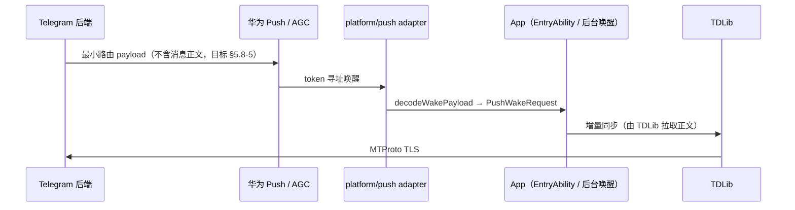

# 威胁模型 v0（SEC-001）

> 版本：v0（Phase 0 基线）。每个大版本更新必须同步更新本文件与数据流图（计划 §14.4）。
> 严重度定义采用计划 §16：P0 = 数据泄漏、账号串线、密钥泄漏、远程利用、数据损坏；P1 = 核心功能不可用、稳定崩溃、消息丢失、严重性能退化；P2 = 有规避方式的功能缺陷；P3 = 非阻断体验/质量问题。
> 关联决策：D-004（TDLib 为唯一数据权威）、D-005（td_json_client 新式 C API）、D-008（系统能力经 Port/Adapter）。
> 本文档仅覆盖 Phase 0 已冻结架构；新增能力（通话、Stories 等）落地前必须先补充对应威胁行。

## 1. 系统数据流图

### 1.1 主数据流（运行时）

```mermaid
flowchart TB
  subgraph DEV["📱 终端设备（HarmonyOS NEXT，API 26）"]
    subgraph APP["进程内：org.telegram.x.harmony Entry HAP"]
      UI[ArkUI View / Page] --> VM[Feature ViewModel / Reducer]
      VM --> UC[Use Cases]
      UC --> PORT[Domain Repository / Platform Ports]
      PORT --> TG[TdGateway<br/>core/td_gateway]
      TG --> DTO[Generated TDLib DTO + Codec<br/>core/td_api_generated]
      DTO --> BR[Node-API Bridge<br/>native/tdcore → libtdcore.so]
      BR --> TD[TDLib C++ Core<br/>SQLite + Files]
      BR -->|thread-safe callback,<br/>bounded queue, monotonic sequence| ER[Ordered Event Router]
      ER -->|strict per-client ordering| VM
      PORT --> PAD[Platform Adapters<br/>platform/*]
      PAD --> KIT[Push Kit / Notification /<br/>Media / Camera / Security(HUKS) /<br/>Files / Background / Share]
    end
    HUKS[(HUKS / Asset Store<br/>data key 托管)]
    PAD --> HUKS
  end

  TD -->|MTProto over TLS| NET[Telegram 网络]
  NET -->|Push 下发| HPS[华为 Push 服务 / AGC]
  HPS -->|Push 通道| PAD
  EXT[系统 Picker / Media Library<br/>导入导出] --> KIT
  KIT --> EXT

  classDef tb fill:#fff3cd,stroke:#c00,stroke-dasharray:5 5;
  class BR,NET,HPS,EXT,HUKS tb
```

### 1.2 Push 唤醒数据流



关键约束（计划 §5.8）：payload 不承载多余正文；客户端唤醒后由 TDLib 同步；端到端 Push 失败时禁止 AI 自行增加转发服务器，须形成 `ADR-PUSH-FAILURE` 由用户决策。

### 1.3 信任边界（TB）

| 边界 | 位置 | 不可信输入 / 风险 |
|---|---|---|
| TB-1 ArkTS ↔ Node-API | ArkTS 运行时与 libtdcore.so 之间 | JSON 请求/事件的所有字段；`clientId`、`sequence`、handle 有效性；64 位 ID 精度 |
| TB-2 设备 ↔ Telegram 网络 | TDLib MTProto over TLS | 服务端下发的任意 TDLib update、文件内容、恶意构造的消息/媒体 |
| TB-3 设备 ↔ 华为 Push / AGC | Push Kit token 注册与唤醒 payload | payload 解析、token 轮换/伪造、中间服务被滥用 |
| TB-4 App ↔ 系统 Kit | platform/* adapters ↔ Push/Notification/Media/Camera/HUKS/Picker | 系统回调数据、外部 picker 返回的媒体/文件、URI 权限授权范围 |
| TB-5 进程内跨层 | feature → domain → platform_api | 跨账号数据串线（EventRouter 排序/隔离失效）、敏感字段流入日志 |
| TB-6 持久化介质 | TDLib SQLite/Files、RDB、Preferences | 设备丢失/被 root 后的静态数据暴露；备份导出 |

## 2. 资产清单

| # | 资产 | 存储位置 | 敏感性 | 泄漏后果 |
|---|---|---|---|---|
| A-1 | TDLib 数据库加密 key | 由 HUKS/Asset Store 包装的随机 data key；**禁止**进入 Preferences/JSON | 极高 | 整个本地消息库被解密 |
| A-2 | 账号 session（auth key / 登录态） | TDLib 数据库内（由 A-1 加密） | 极高 | 账号被接管 |
| A-3 | 消息正文、联系人、群组成员 | TDLib SQLite（加密） | 高 | 隐私泄漏 |
| A-4 | 文件（图片/视频/语音/文档） | `filesDir/accounts/<key>/tdlib/files/` 与 cache | 高 | 内容泄漏；cache 可被他应用经系统分享读取 |
| A-5 | Push token | TDLib（经 `registerDevice` 注册）与 Push Kit | 中 | 推送被定向骚扰/伪造唤醒 |
| A-6 | 代理凭据（地址/端口/密码） | TDLib options；**禁止**进入 Preferences/JSON | 高 | 凭据泄漏、流量被劫持 |
| A-7 | api_id / api_hash | 构建期注入（本地产物/CI 变量），**不入库** | 中 | 被他人冒用应用身份 |
| A-8 | 2FA 密码、验证码、手机号 | 仅存于 TDLib 会话过程，不落盘 ArkTS 侧 | 极高 | 账号接管 |
| A-9 | RDB / Preferences 内容 | 账号清单、schema 版本、主题字号等非敏感偏好 | 低 | 低 |

目录与生命周期规则见计划 §5.6：`cacheDir` 可删可重建，`filesDir` 删除须经账号生命周期。

## 3. 威胁与风险表

等级列按 §16 严重度；每行的缓解措施必须能在 CI/评审中核验。

| # | 类别 | 威胁 | 入口 | 影响 | 等级 | 缓解措施 | 残余风险 |
|---|---|---|---|---|---|---|---|
| T-01 | 账号 | 本地 TDLib 数据库被离线解密（设备丢失/root） | TB-6 | 全部消息与 session 泄漏 | P0 | 加密 key 用 HUKS/Asset Store 包装的随机 data key（§5.6）；key 不落 Preferences/JSON；数据库目录限定 sandbox | 已 root 设备上系统级密钥仍可能被提取（不可根除，需文档声明） |
| T-02 | 账号 | 数据库 key / session / 代理凭据写入日志、fixture、截图 | TB-5 | 密钥/聊天内容进入证据链并扩散 | P0 | 日志按字段白名单输出，禁止“全量记录+正则脱敏”（§14.4）；CI secret scan + 证据扫描；隔离测试账号 | 人工截图仍可能含真实数据，依赖流程检查 |
| T-03 | 账号 | EventRouter 乱序/串账号导致 A 账号状态进入 B 账号 UI | TB-5 | 消息串线、隐私交叉泄漏 | P0 | 单序列、有界队列、严格 per-client 排序（D-007）；64 位 ID 用 bigint/字符串往返测试（§5.2）；replay/fuzz 测试 | 极端背压下仍需压测冻结队列阈值 |
| T-04 | 消息 | 恶意构造的 TDLib update/消息 JSON 触发解析崩溃或逻辑错乱 | TB-1/TB-2 | 崩溃、状态损坏 | P0（数据损坏）/ P1（崩溃） | 生成器运行时校验器 + unknown constructor forward-compatible fallback（§5.3）；bridge 输入 UTF-8/长度/结构校验（§5.2）；fuzz | 全量 schema 覆盖前的最小子集存在解析盲区 |
| T-05 | 消息 | Push payload 承载正文或诱导即时展示未同步消息 | TB-3 | 通知栏泄漏消息内容 | P1（P2 体验降级可规避） | payload 最小路由化，正文由 TDLib 拉取（§5.8-5）；token 轮换/清数据/重装行为验证（§5.8-6） | Push 通道本身由华为/AGC 信任，超出客户端控制 |
| T-06 | Push | Push token 泄漏或被他人注册到别的后端 | TB-3 | 定向推送伪造/骚扰 | P1 | token 仅经 TLS 由 TDLib `registerDevice` 上报；token 变更监听并重新注册；token 不写入日志 | token 在系统层对华为可见，属平台信任假设 |
| T-07 | 文件 | 恶意媒体文件（图片/视频）触发解码器漏洞 | TB-2/TB-4 | 远程代码执行 | P0（远程利用） | 优先使用系统 Image Kit / Media Kit AVPlayer（§5.9、D-010），不自建解码栈；按缺口逐库引入并单独评审；媒体在 sandbox 内处理 | 引入额外 codec 库（若发生）重新引入本威胁，需逐库登记 |
| T-08 | 文件 | 经 Picker/Media Library 导入的恶意文件或越权 URI | TB-4 | 越界读写、路径暴露 | P1 | 导入导出只经系统 Picker/Media Library，不暴露 sandbox 路径（§5.6）；URI 权限按次校验、用完释放 | 无 |
| T-09 | 文件 | cacheDir 文件被系统分享/其他应用读取 | TB-6 | 媒体内容外泄 | P2 | cache 目录不长期存放唯一副本；敏感文件优先放 filesDir 加密区；分享只经系统能力 | 系统分享行为依赖平台策略 |
| T-10 | native bridge | Node-API 层越界：非法 handle、线程误用、C++ exception 穿 ABI | TB-1 | use-after-free、进程崩溃 | P0（数据损坏/远程利用面）/ P1 | `napi_env/napi_ref` 禁跨线程，经官方线程安全回调（§5.2）；错误转稳定结构，exception 不穿 ABI；handle 有效性校验；closeClient 幂等，关闭后事件安全丢弃并计数 | 原生层内存缺陷需依赖 ASAN/符号化测试覆盖 |
| T-11 | native bridge | 64 位业务 ID / sequence 经 JS number 精度丢失 | TB-1 | 消息错乱、串线 | P0（数据损坏） | 统一 bigint 或十进制字符串并做往返测试（§5.2）；`clientId` int32 范围校验 | 无（契约可测试） |
| T-12 | 存储 | Preferences/JSON/RDB 误存敏感字段（key、token、代理密码） | TB-5/TB-6 | 静态凭据泄漏 | P0 | §5.6 明令禁止；RDB 只存 app-owned 非敏感数据；PR checklist + 依赖/存储边界检查 | 新增字段时仍需人工确认敏感性 |
| T-13 | 存储 | schema migration 中断导致 TDLib 库损坏 | TB-6 | 消息库不可恢复 | P0（数据损坏） | 每个 migration 前向/中断/回滚测试与恢复策略（§5.6）；SQLite 文件锁、fsync、空间不足 P0 验证（§5.1） | 断电类硬故障仍可能造成最后一批事务丢失（SQLite WAL 内可接受范围） |
| T-14 | 供应链/CI | 依赖或产物带入恶意代码、高危 CVE | 构建链 | 后门、密钥外发 | P0（远程利用） | 固定 toolchain/依赖版本（§5.1）；CI 跑 SAST/SBOM/漏洞/许可证扫描（§14.4）；高危漏洞阻断发布；Release 符号与 commit/build-id 绑定存私有制品库 | 上游 TDLib 升级窗口内可能存在未修复 CVE |
| T-15 | 隐私/合规 | 权限过度申请；拒绝权限后功能整体不可用 | TB-4 | 合规与信任问题 | P2 | 权限按需申请，拒绝后不相关能力仍可用（§14.4）；platform adapter 抽象便于最小化 | 无 |
| T-16 | 凭据 | api_id/api_hash 提交进 git 或写入构建产物常量后入库 | 仓库/CI | 应用身份被冒用 | P1 | 构建期注入 + `.gitignore` 制品校验；CI secret scan 阻断；PR 模板提醒 | 本地开发机明文存放属接受残余风险 |

## 4. 秘密管理规则（强制）

源自计划 §14.4 与 §5.6，从第一天执行：

1. **禁止入库**：api_id、api_hash 不得进入 git、构建脚本常量、fixture 或任何提交文件；仅经本地环境变量/私有制品注入，CI 用 secret 变量。
2. **测试账号隔离**：所有测试、录屏、截图、行为样本只使用专用隔离测试账号；禁止在任何证据中出现真实手机号、用户名、验证码、消息正文、session token、私钥、代理密码。
3. **证据脱敏**：文档/截图/日志作为证据提交前必须人工或脚本核验脱敏；发现泄漏立即按 §18 “密钥/聊天内容泄漏到证据”处理：P0、吊销相关凭据并清理。
4. **日志白名单**：日志按字段白名单输出；禁止“先完整记录再正则脱敏”。敏感字段元数据由 TDLib 类型生成器产出，用于日志自动脱敏（§5.3）。
5. **密钥存储**：TDLib database key、账号令牌、代理凭据使用 Asset Store 或 HUKS 包装的随机 data key；一律不得进入 Preferences/JSON/RDB。
6. **扫描**：CI 运行 secret scan、SAST、SBOM、漏洞与许可证扫描；高危漏洞阻断发布，P0/P1 安全问题不允许豁免（§14.4）。
7. **豁免**：任何 P0–P3 豁免必须含负责人、理由、补偿措施和失效日期，最长一个里程碑（§16）。

## 5. 与计划 §18 风险登记册的映射

| 风险登记册条目 | 本模型对应 | 说明 |
|---|---|---|
| 密钥/聊天内容泄漏到证据（中/极高） | T-02、§4 | 登记册应对“隔离账号、白名单日志、扫描”已全部落到 T-02 缓解列 |
| EventRouter 乱序/背压失控（中/极高） | T-03 | “任何语义事件丢失进入 BLOCK”作为验收红线保留 |
| TDLib 无法稳定适配 musl/NDK（中/极高） | T-13、T-14 | 数据损坏与供应链面；P0 单独 fork、补丁收敛 |
| Push token 无法被后端使用（高/极高） | T-05、T-06、§1.2 | 失败时走 `ADR-PUSH-FAILURE`，禁止自建转发 |
| JSON bridge 性能不足（中/中） | T-11（伴随） | 性能问题本身非安全威胁；但任何“重写全桥”方案须经 ADR 并复审 T-10/T-11 |
| 无现成客户端测试基线（高/高） | T-04、T-13 | 解析与 migration 缺陷依赖 fixture/replay 差分测试兜底 |
| Android 技术债被复制（高/高） | T-03、T-12 | 依赖检查、契约先行、PR 限制 |
| 媒体格式能力缺口（中/高） | T-07、T-08 | 系统能力优先，逐 codec 引入需逐库威胁登记 |

---

**维护责任**：SEC 区域拥有者负责更新；每次大版本、新增系统能力（Kit）、新增 codec/原生库、或发生 P0/P1 安全事件后必须修订并记录版本。
