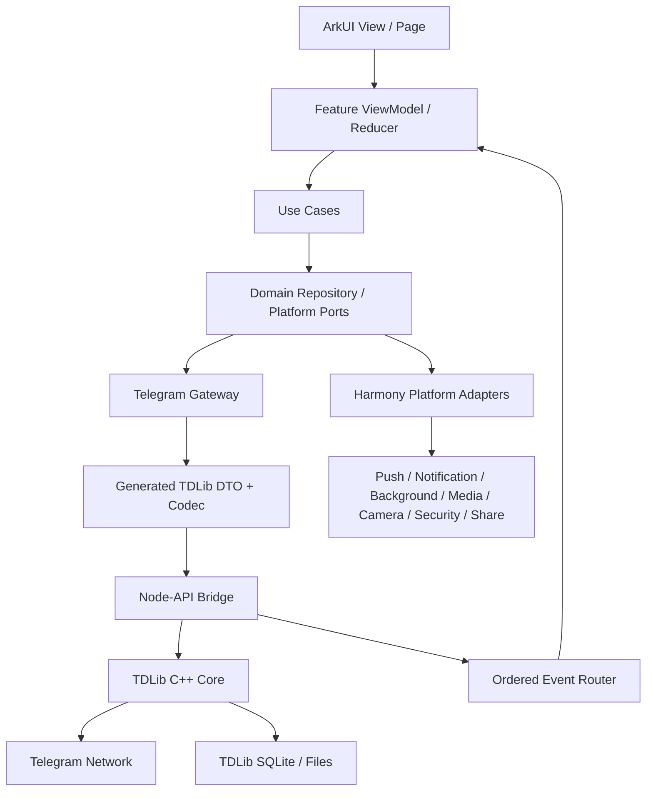
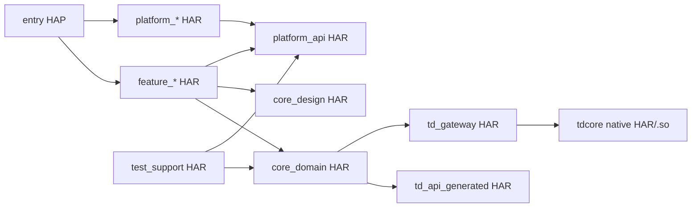
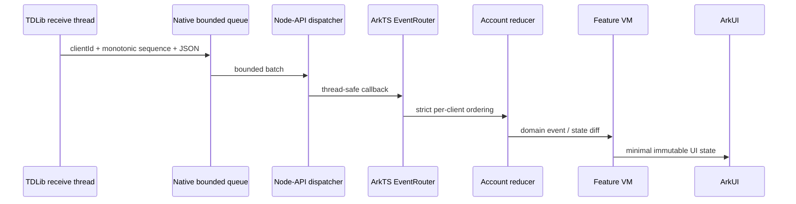
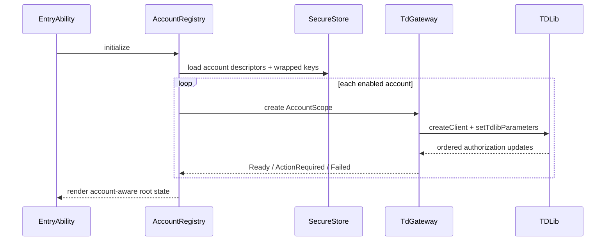
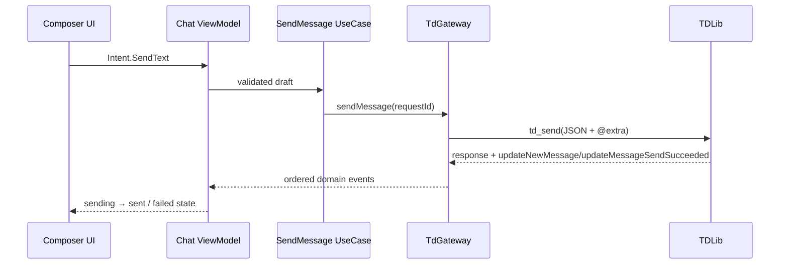
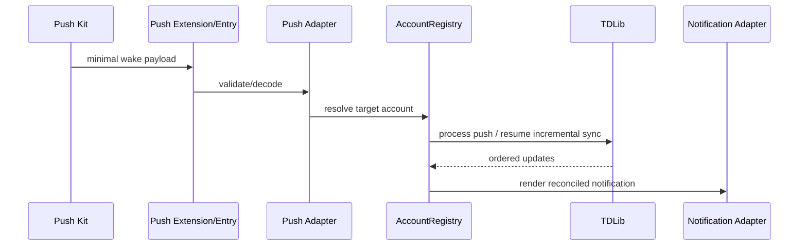

# Telegram X → HarmonyOS NEXT 迁移实施与架构计划

> 文档状态：v1.1（2026-09-14 实施审计修订）  
> 编制日期：2026-09-08  
> 最近审计：2026-09-14，`Telegram-X-HarmonyNext/master@7e75c89`  
> Android 参考基线：`main@80e569a7`  
> 适用对象：架构/调度 AI、实现 AI、检查 AI、测试人员、项目负责人  
> 目标平台：HarmonyOS NEXT，Phone/arm64 优先  
> 计划属性：工程执行蓝图，不是产品需求文档，也不是上架合规意见

---

## 0. 如何使用本文档

本文档是后续所有 AI 开发工作的上位约束。实现 AI 不应从“把某个 Java 类翻译成 ArkTS”开始，而应从本文档定义的工作包、契约、验收标准和依赖关系开始。

执行顺序固定为：

1. 架构负责人从本文档拆出一个满足 Definition of Ready 的工作包。
2. 实现 AI 只在授权目录内完成该工作包，并提交代码、测试与证据。
3. 独立检查 AI 进行静态审查和风险审查。
4. 架构负责人独立重跑验证，给出 `APPROVE` 或 `BLOCK`。
5. 只有 `APPROVE` 的工作包才能更新 Feature/Parity Matrix 并进入合并队列。
6. 只有阶段 Gate 的全部退出证据成立，才能进入下一阶段。

禁止使用“基本完成”“大致可用”“以后补测试”等模糊结论。状态只能是：

`Backlog → Contract Ready → Implementing → Verifying → Accepted`，或 `Blocked / Deferred`。

### 0.1 2026-09-14 当前实施基线

HarmonyOS 实现已经落在独立相邻仓库：

`/Users/mbjpeng-yu01/androidProjects/Telegram-X-HarmonyNext`

当前实现不是空工程：TDLib/Node-API、授权、会话列表、文本聊天、搜索、设置及部分媒体接收已经形成真机纵向切片。但是，经 `master@7e75c89` 审计，项目存在受版本控制的真实 API 凭据、明文签名配置、TDLib 数据库空加密密钥、Native bridge 重入风险、全模块 CI 缺失、架构边界绕过和控制文档失真。因此：

- G3 只能标记为“已有功能证据，等待前置 Gate”，不得标记 Passed。
- G0、G1、G2 均未正式通过。
- 暂停非关键新功能，先执行 1～2 周 Quality Recovery Sprint。
- 完整证据、风险等级和整改顺序见：[2026-09-14 实施审计](IMPLEMENTATION_AUDIT_2026-09-14.md)。

此节优先于本文后续仍以“开工前”措辞描述的初始路线；已经完成的工作不重做，但必须重新满足 Gate 证据。

---

## 1. 结论与不可逆架构决策

### 1.1 总体结论

迁移技术上可行，但必须采用“新客户端 + 复用原生协议核心”的路线：

- HarmonyOS 客户端、导航、状态管理和系统能力全部用 ArkTS/ArkUI 重写。
- TDLib 的 C++ 协议、网络、加密、本地消息数据库和文件管理继续复用。
- ArkTS 与 TDLib 之间通过 HarmonyOS Node-API 建立窄接口。
- Android 版本保留为行为参考、差分测试 oracle 和资源来源，不作为新架构模板。
- 通话、复杂媒体和 Telegram X 特色动画独立成后期工作流，不阻塞聊天 MVP。

### 1.2 本计划冻结的决策

除非通过 ADR 正式推翻，以下决策不可由实现 AI 自行修改：

| ID | 决策 |
|---|---|
| D-001 | HarmonyOS 实现使用相邻独立仓库 `Telegram-X-HarmonyNext`；Android 仓库只作行为参考和差分 oracle。两个仓库均不互相搬迁或删除；通过 ADR-003 记录这一实施偏差。 |
| D-002 | 使用 Stage 模型，首期一个 Entry HAP；业务和基础能力以源码 HAR 模块化。没有明确多 HAP 共享收益时不引入 HSP。 |
| D-003 | UI 使用 ArkUI，页面内部采用 MVVM + 单向数据流；业务逻辑不写入 ArkUI Component。 |
| D-004 | TDLib 是 Telegram 数据唯一权威来源；ArkTS 不建立第二套完整消息数据库。 |
| D-005 | P0/P1 的 TDLib 桥接优先使用 `td_json_client` 新式全局 client-id C API；不采用将废弃的旧 pointer client API。 |
| D-006 | TDLib JSON 类型、构造器映射和校验器必须代码生成；禁止手写维护全量 TDLib 类型。 |
| D-007 | 所有 TDLib update 按 account/client 严格有序进入唯一 EventRouter；页面不得直接订阅 Native 回调。 |
| D-008 | 所有 Harmony 系统能力通过 Port/Adapter 暴露；Feature 不得直接依赖 Push、媒体、相机、存储等 Kit。 |
| D-009 | 首期只保证 Phone + arm64；x86_64 只服务模拟器和 CI。平板、折叠屏和 PC 在 P2 后进入验收矩阵。 |
| D-010 | 系统媒体能力优先；FFmpeg、VPX、Opus、rlottie 等按缺口逐库引入，不复刻 Android 的“大 JNI 库”。 |
| D-011 | 通话栈为独立可关闭能力，必须通过真机 PoC 后才能承诺正式排期。 |
| D-012 | 无测试、无构建证据、无真机证据的实现不得标记为完成。 |
| D-013 | Gate 不得越级通过；后续阶段可提前收集证据，但前置 Gate 未通过时只能标记 `Pending upstream gates`。 |
| D-014 | 任何受版本控制的真实凭据、空数据库加密密钥或不能复现的签名配置均为 P0，阻断可分发构建。 |
| D-015 | 实现 AI 不直接提交/推送；一个文件同一时刻只有一个写入 owner，架构负责人在独立检查和重跑验证后统一合并。 |

### 1.3 当前假设

本计划在以下假设下成立：

- “纯血鸿蒙”允许使用 HarmonyOS NDK 编译的 C/C++ `.so` 和 Node-API；不包含 Android 兼容层、APK、JVM 或 Android SDK。
- 首期以功能正确、稳定和鸿蒙原生体验为目标，不追求逐像素复制 Telegram X。
- 首期不新增业务后端，继续直接使用 Telegram/TDLib；Push 能否形成端到端闭环必须在 P0 验证。
- 用户后续可提供 Telegram `api_id/api_hash`、隔离测试账号、DevEco/Harmony SDK、签名配置及至少两台真机。
- 上架与中国大陆合规暂不作为本阶段 Gate，但 GPL、第三方许可证和秘密管理从第一天执行。

### 1.4 明确非目标

- 不逐文件、逐类、逐行翻译 Java/Kotlin。
- 不保留 Android Activity/View/Service/Receiver/Provider 架构。
- 不在 UI 层直接使用原始 TDLib JSON 或 Native handle。
- 不用后台任务类型伪装常驻进程。
- 不在 MVP 同时追求群组通话、Stories、视频编辑、Web App 和全部特色动画。
- 不为“未来可能需要”提前构建复杂插件框架、分布式数据库或自有消息缓存系统。

---

## 2. 现有项目基线审计

### 2.1 规模

基于 `main@80e569a7` 的只读审计：

| 项目 | 结果 |
|---|---:|
| 主应用 Java/Kotlin | 约 498,483 行 |
| 主应用 Java/Kotlin 文件 | 1,115 个 |
| `*Controller` 文件 | 约 138 个 |
| `*View` 文件 | 约 180 个 |
| 直接使用 TDLib/TdApi 的文件 | 约 445 个 |
| 直接引用 Android UI/系统包的文件 | 约 770 个 |
| 主应用 native 声明 | 约 114 处 |
| 客户端级有效自动化测试 | 接近 0 |

主要代码集中区域：

- `ui`：约 11.9 万行。
- `component`：约 5.6 万行。
- `data`：约 5.5 万行。
- `telegram`：约 5.2 万行。
- `widget`：约 3.4 万行。
- `navigation`、`mediaview`：各约 2.8 万行。

典型巨型类：

- `MessagesController.java`：约 12.8k 行。
- `Tdlib.java`：约 12.4k 行。
- `TGMessage.java`：约 10k 行。
- `MediaViewController.java`：约 9.4k 行。
- `TdlibUi.java`：约 8.2k 行。
- `Settings.java`：约 7.3k 行。

结论：现有代码应作为功能行为样本，不能继承其单体结构和 UI/业务/平台耦合。

### 2.2 当前模块及迁移判断

| 当前模块 | 当前职责 | NEXT 处理 |
|---|---|---|
| `:app` | UI、导航、TDLib 封装、通知、媒体、相机、设置、通话、JNI | 全部重新分层实现；仅参考行为和资源 |
| `:tdlib` | TDLib 源码 + Java/JNI binding | 复用 C++ 核心；废弃 Java/JNI，改为 Node-API |
| `:tgcalls` | WebRTC Android Java glue + native calls | 原生核心尝试移植；Android glue 全部重写 |
| `:vkryl:core` | 集合、算法、工具 | 逐项参考移植，禁止整包翻译 |
| `:vkryl:android` | Android 工具与 UI | 不复用代码 |
| `:vkryl:td` | Java TDLib helper | 基于生成的 ArkTS 类型重建 |
| `:vkryl:leveldb` | Android LevelDB/JNI | 不用于消息镜像；客户端设置使用鸿蒙存储 |
| `:extension:hms` | Android HMS Push | 仅参考 token/通知业务语义，代码全重写 |
| `buildSrc` | Gradle 生成语言、主题、emoji、API helper | 保留输入和生成思想，改为独立工具链 |
| `baseline-profile` | Android 性能配置 | 无复用价值 |

### 2.3 原生依赖策略

现有 `tgxjni` 聚合 TDLib、OpenSSL、Opus/Ogg、FLAC、libyuv、VPX、rlottie、LZ4、WebP、FFmpeg 和 tgcalls，并链接 Android 专属库。NEXT 不得复制这种边界。

目标拆分：

1. `libtdcore_napi.so`
   - TDLib、加密/压缩/数据库必需依赖、Node-API。
   - 只暴露 create/send/receive/execute/close/log/version。
   - 不依赖 UI、媒体和系统业务 Kit。

2. `libmedia_codec_napi.so`
   - 仅承载系统能力无法覆盖的 rlottie、Opus/Ogg、FFmpeg、WebP/libyuv 等。
   - 每个 codec 有独立编译开关、许可清单和测试。

3. `libtgcalls_napi.so`
   - tgcalls/WebRTC/音视频通话专用。
   - 与 HarmonyOS 音频、相机、Surface、网络和 Call Service 通过独立 adapter 连接。

所有预编译依赖必须由同一锁定版本的 HarmonyOS NDK/Clang/libc++ 重新编译；禁止混入 Android `.so`。

---

## 3. 产品范围与优先级

### 3.1 P0：可行性验证，不是产品版本

必须具备：

- TDLib 及最小依赖在 HarmonyOS NDK 下生成 arm64 Release `.so`。
- Node-API 完成 create/send/receive/execute/close。
- 真机完成授权、拉取会话列表、打开聊天、收发文本、重启恢复。
- 数据目录隔离、数据库密钥保存、异常退出恢复。
- 前后台、断网重连和 24 小时 update soak。
- 新 bundle 的 Push Kit token 是否能经 Telegram 后端完成端到端唤醒。
- tgcalls/WebRTC + OHAudio/Camera 的双向音视频最小 PoC。

P0 不追求正式 UI，只追求可重复、可度量、可证伪。

### 3.2 P1：核心聊天 MVP

- 手机号/验证码/2FA/二维码授权状态机。
- 单账号和多账号基础框架；登录、登出、切换。
- 会话列表分页、置顶、归档、未读状态。
- 私聊、群组、频道的基础消息流。
- 文本、链接、回复、转发、编辑、删除、复制。
- 图片、视频、文件、语音消息上传/下载/进度/失败重试。
- 基础媒体查看和播放。
- 基础全局搜索与聊天内搜索。
- Push、通知点击跳转、前后台恢复。
- 基础设置：语言、通知、存储、隐私入口。
- 中文、英文、深浅色、默认/大字体的关键路径。

### 3.3 P2：公开 Beta 完整度

- 联系人同步和新建会话。
- 群组/频道创建、成员、权限、邀请链接。
- 反应、投票、置顶、话题/论坛。
- Sticker、emoji、GIF、动画贴纸。
- CameraPicker、相册、文件选择、系统分享。
- 完整媒体查看器、后台音频、AVSession。
- 代理、下载策略、缓存清理。
- Passcode、生物识别、活跃会话管理。
- 实时位置、地图 adapter。
- `tg://`、`t.me` 深链与 Share Extension。
- 平板/折叠屏基础双栏、无障碍与 RTL。

### 3.4 P3：高级功能

- 一对一语音/视频通话。
- 群组通话和直播。
- Stories。
- 视频压缩、裁剪、编辑。
- Instant View、Web App/Game。
- 高级主题编辑、完整 Telegram X 动画和特色手势。
- PC/2in1、穿戴等另行定义的鸿蒙场景。

### 3.5 版本降级原则

若 P0 的 Push 或 Call Go/No-Go 未通过：

- 聊天前台能力仍可继续验证。
- 不允许伪装后台常驻。
- 将“可靠后台通知”或“通话”明确标记为 `Blocked`，重新估算范围。
- 不得由实现 AI 临时增加未知代理服务或云转发服务；新增后端属于架构与合规范围变更，必须由用户批准并建立新 ADR。

---

## 4. 目标软件架构

### 4.1 总体分层



依赖只允许从上向下。反向通知只能通过接口或有序领域事件，不允许跨层持有对象。

### 4.2 模块依赖规则



强制规则：

- `feature_*` 之间不得直接依赖；跨功能协调经 application coordinator 或领域事件。
- `core_domain` 不得 import ArkUI、Ability、Node-API 或具体 Kit。
- `platform_api` 只有接口和稳定数据模型；具体实现放 `platform_*`。
- 只有 `td_gateway` 可发送 TDLib request。
- 只有 `tdcore` 可调用 Node-API/native TDLib。
- `entry` 只负责装配、生命周期、路由根和 ExtensionAbility 注册，不承载业务规则。
- 测试 fake 必须实现与生产 adapter 相同的契约。

### 4.3 推荐仓库结构

```text
Telegram-X/
├── app/                         # 原 Android 参考实现，首期不改
├── tdlib/                       # 上游 submodule；使用受控 fork/patch
├── harmony/
│   ├── AppScope/
│   ├── entry/                   # Entry HAP、UIAbility、路由、装配
│   ├── core/
│   │   ├── common/              # Result、时钟、ID、基础集合、错误
│   │   ├── domain/              # 领域模型、UseCase、Repository Port
│   │   ├── account/             # AccountScope、授权与生命周期
│   │   ├── td_api_generated/    # 自动生成 TDLib types/codecs
│   │   ├── td_gateway/          # request registry、EventRouter
│   │   ├── storage/             # app-owned RDB/preferences schema
│   │   ├── design_system/       # token、组件、主题、排版
│   │   ├── navigation/          # typed routes、deep link mapping
│   │   └── observability/       # 脱敏日志、指标、trace
│   ├── platform/
│   │   ├── api/
│   │   ├── push/
│   │   ├── notification/
│   │   ├── background/
│   │   ├── network/
│   │   ├── security/
│   │   ├── files/
│   │   ├── media/
│   │   ├── camera/
│   │   ├── audio/
│   │   ├── contacts/
│   │   ├── location/
│   │   ├── share/
│   │   └── calls/
│   ├── feature/
│   │   ├── auth/
│   │   ├── chat_list/
│   │   ├── chat/
│   │   ├── composer/
│   │   ├── media_viewer/
│   │   ├── search/
│   │   ├── contacts/
│   │   ├── profile/
│   │   ├── group_channel/
│   │   ├── settings/
│   │   ├── stickers_emoji/
│   │   └── calls/
│   ├── native/
│   │   ├── tdcore/
│   │   ├── media/
│   │   └── tgcalls/
│   ├── tools/
│   │   ├── td_api_codegen/
│   │   ├── license_inventory/
│   │   └── parity_capture/
│   ├── test/
│   │   ├── support/
│   │   ├── fixtures/
│   │   ├── contract/
│   │   └── e2e/
│   ├── docs/
│   │   ├── architecture/
│   │   │   └── adr/
│   │   ├── contracts/
│   │   ├── product/
│   │   ├── quality/
│   │   └── runbooks/
│   ├── work-items/
│   │   ├── backlog/
│   │   ├── active/
│   │   └── accepted/
│   ├── build-profile.json5
│   ├── hvigorfile.ts
│   └── oh-package.json5
└── docs/                        # 现有 Android 文档
```

首期不要为每个页面创建 HAR。Feature HAR 应对应稳定业务边界，而不是页面数量。

---

## 5. 核心运行时设计

### 5.1 TDLib 构建与版本管理

策略：

- 固定 TDLib submodule commit、Harmony SDK/NDK、Clang、CMake、Ninja 和所有 native 依赖版本。
- 在 P0 决定采用“自有 `ohos` fork”还是“上游源码 + patch series”。补丁少且可上游时使用 patch series；持续性平台差异较大时使用 fork。
- 构建产物至少包括 arm64-v8a Release、arm64-v8a 带符号 Debug、x86_64 模拟器版本。
- 所有依赖使用相同 Clang 大版本和相同 libc++ 方案。
- Release 符号剥离，但完整 native symbols 保存到私有制品库，并与 commit/build-id 绑定。
- 每次升级 TDLib 先运行 schema diff、native test、bridge contract、fixture replay，再进入 Feature 回归。

P0 需要单独验证：

- musl/POSIX 差异。
- TLS、系统证书和时钟。
- SQLite 文件锁、fsync、异常退出和空间不足。
- IPv4/IPv6、Wi‑Fi/蜂窝切换、代理。
- arm64 原子操作、线程本地存储、信号与崩溃符号化。
- OpenSSL/BoringSSL 的选择、包体和许可证影响。

### 5.2 Node-API 最小契约

Native 对外接口必须保持窄、稳定、可测试。示意：

```ts
export interface TdNativeBridge {
  getVersion(): NativeVersionInfo;
  createClient(accountKey: string, options: NativeClientOptions): number;
  send(clientId: number, requestUtf8: string): void;
  execute(requestUtf8: string): string | null;
  subscribeUpdates(sink: TdNativeEventSink): NativeSubscription;
  closeClient(clientId: number): Promise<void>;
  shutdown(): Promise<void>;
}

export interface TdNativeEvent {
  schemaVersion: number;
  clientId: number;
  sequence: bigint;
  payloadUtf8: string;
  receivedAtMonotonicMs: number;
}
```

约束：

- Telegram 的 64 位业务 ID 与单调 `sequence` 禁止经过不安全的 JS `number`；统一使用 `bigint` 或十进制字符串，并做往返测试。TDLib 全局 API 返回的 `clientId` 是 int32，使用经过整数和范围校验的 ArkTS `number`。
- 每个 request 写入唯一 `@extra.requestId`；RequestRegistry 负责 Promise 关联、超时、取消和迟到响应。
- `napi_env/napi_value/napi_ref` 不能在 TDLib 子线程直接使用；必须通过官方线程安全回调机制回到 ArkTS 线程。
- Native 不持有 ArkUI Component、ViewModel 或业务对象。
- `closeClient` 是幂等操作；关闭后到达的事件必须安全丢弃并计数，不能触发 use-after-free。
- Native error 统一转换为稳定错误结构，不将 C++ exception 穿过 ABI。
- 所有输入有 UTF-8、长度、空值、JSON 结构和 handle 有效性校验。

### 5.3 TDLib 类型生成

以 `tdlib/source/td/td/generate/scheme/td_api.tl` 为单一输入，工具至少生成：

- ArkTS request/update/object discriminated unions。
- `@type` 构造器到类型的映射。
- JSON encode/decode 和运行时校验器。
- 可识别未知字段/未知构造器的 forward-compatible fallback。
- 敏感字段元数据，用于日志脱敏。
- 请求返回类型映射。
- schema hash 和生成器版本。

CI 必须执行“重新生成后工作树无差异”。生成代码不得手改。

P0 可以先生成授权、会话、消息最小子集，但生成器架构必须能覆盖全量 schema。P1 前完成全量生成。

### 5.4 事件顺序、并发与背压



规则：

- 每个 client 分配单调 `sequence`，语义 update 不得丢失、乱序或跨账户。
- Native 队列必须有界；队列大小和告警阈值在 P0 压测后冻结。
- 允许合并/降采样：下载进度、上传进度、typing、连接质量、播放进度。
- 禁止丢弃：新消息、删除/编辑、授权状态、账号状态、文件完成、权限变化。
- 批量对象跨 ArkTS Actor 会产生拷贝，默认批次需按字节数和延迟双阈值控制。
- UI 主线程只做 decode 后的最小状态提交和渲染；JSON 解析与大列表 diff 在性能证明需要时转 TaskPool/Worker。
- 不提前引入自定义二进制协议。只有 P1 性能门禁证明 JSON 是瓶颈，才通过 ADR 对高频路径使用 ArrayBuffer/native 过滤。

### 5.5 AccountScope 与生命周期

每个账号拥有独立 `AccountScope`：

```text
AccountScope
├── accountId / clientId
├── TdGateway
├── AuthorizationStateMachine
├── OrderedEventReducer
├── bounded in-memory projections
├── download/upload coordinators
├── account-specific directories
└── lifecycle + cancellation owner
```

不得使用承载所有账户的可变全局单例。全局 `AccountRegistry` 只管理 scope 的创建、激活、休眠和销毁。

状态机至少覆盖：

- 创建、等待参数、等待数据库密钥。
- 等待手机号、邮箱、验证码、2FA、注册、二维码确认。
- Ready、LoggingOut、Closing、Closed。
- 网络中断、TDLib restart、数据库错误、客户端升级。

所有状态转换必须使用纯 reducer 测试；UI 只渲染状态并发出 intent。

### 5.6 数据存储

目录建议：

```text
filesDir/
  accounts/<account-key>/tdlib/db/
  accounts/<account-key>/tdlib/files/
  accounts/<account-key>/exports/
cacheDir/
  thumbnails/
  transcode/
  share/
```

规则：

- TDLib 数据库保存聊天、消息、文件索引；不复制到 ArkTS RDB。
- Preferences 只保存小型、非敏感开关，如主题、字号、UI 偏好。
- RDB 只保存 app-owned 结构化数据，如账号清单、schema 版本、功能开关、局部草稿补充和测试标记。
- TDLib database encryption key、账号令牌、代理凭据使用 Asset Store 或 HUKS 包装的随机 data key。
- cache 必须可删除、可重建；files 数据删除需经明确账号生命周期。
- 导入/导出只通过系统 Picker/Media Library，不暴露 sandbox 路径。
- 每个 schema migration 必须有前向测试、异常中断测试和回滚/恢复策略。
- 禁止把真实消息正文、手机号、token 或 proxy 密码写入普通日志、测试 fixture 或截图。

### 5.7 网络与应用生命周期

- 前台：TDLib 正常在线。
- 普通后台：预期进程会被挂起或杀死，不依赖常驻 socket。
- 短时任务：仅用于发送收尾、flush、小文件等受限操作。
- 长时任务：仅用于用户可感知的数据传输、音频播放/录音、定位或 VoIP，并正确展示系统提示。
- 延迟任务：用于非实时维护，不承担即时消息。
- Push 唤醒：收到最小路由信息后启动增量同步，正文仍由 TDLib 获取。
- 监听默认网络变化，将网络可用性和切换信号发送给 gateway；专项测试 IPv4/IPv6、Wi‑Fi↔蜂窝、代理切换。

### 5.8 Push 与通知

Push 是 P0 一级风险：TDLib 存在 Huawei token 类型，不代表新 Harmony bundle 的 AGC token 能被 Telegram 后端识别和发送。

必须验证：

1. 新 bundle 获取 Push Kit token。
2. token 通过 TDLib `registerDevice` 注册。
3. Telegram 后端向该 token 发送。
4. App 被挂起、杀死、锁屏和重启后能被正确唤醒。
5. payload 不承载多余正文；客户端唤醒后由 TDLib 同步。
6. token 轮换、清数据、重装、双账号和通知关闭行为正确。

目标接口：

```ts
export interface PushPort {
  getToken(): Promise<string>;
  observeTokenChanges(): AsyncIterable<string>;
  decodeWakePayload(payload: Uint8Array): Promise<PushWakeRequest>;
}

export interface NotificationPort {
  showMessage(model: MessageNotification): Promise<void>;
  updateMessage(model: MessageNotification): Promise<void>;
  cancel(key: NotificationKey): Promise<void>;
  reconcile(expected: ReadonlyArray<MessageNotification>): Promise<void>;
}
```

若端到端 Push 失败，禁止实现 AI 自行增加转发服务器。必须形成 `ADR-PUSH-FAILURE`，列出 Telegram 官方合作、自建服务或功能降级三种方案，由用户决定。

### 5.9 媒体与相机

首选策略：

- 图片：ArkUI Image/Image Kit。
- 普通音视频播放：Media Kit AVPlayer。
- 语音/音乐后台播放：AVPlayer/AudioRenderer + AVSession + 合法连续任务。
- 拍照/录像 MVP：CameraPicker。
- 自定义相机：Camera Kit + XComponent Surface。
- 通话帧：优先 C++ OHAudio/native camera Surface 直接连接 tgcalls，禁止 PCM/YUV 大帧穿越 NAPI。
- 动画贴纸：先验证系统/ArkUI 能力；不足时引入单独的 rlottie native adapter。
- Opus/FFmpeg/WebP/VPX：按真实格式缺口和基准结果逐项引入。

每个播放器/录制器必须实现显式状态机、错误恢复和幂等 release；页面离开、进后台、音频焦点变化和来电中断必须有测试。

### 5.10 通话

通话分三层：

1. Telegram call signaling：TDLib。
2. 实时媒体：tgcalls/WebRTC + OHAudio/Camera/Surface。
3. 系统体验：`IncomingCallPlatformPort`，在支持地区使用 Call Service Kit，其他地区采用可用的通知/前台方案。

Call Service Kit 当前存在地区和真机限制，Push 的旧 VoIP Extension API 也存在版本变化风险。因此必须通过 adapter 屏蔽具体 API，并在 P0 向华为当前 SDK 文档/支持渠道确认推荐路径。

通话不得在 P1 核心聊天完成前侵入 Account、Message、Navigation 的公共契约。

### 5.11 UI、导航与状态

- 页面使用 ArkUI 状态管理 V2；领域模型保持普通不可变对象，不添加 UI 装饰器。
- 每个 Feature 使用 `UiState + Intent + Effect`：Reducer 纯函数，异步副作用由 UseCase/EffectHandler 执行。
- 导航使用 typed route，参数必须可序列化、可恢复；禁止传递 ViewModel/native handle。
- 会话和消息列表使用稳定 key、分页和最小 diff；不得因单个文件进度更新重建整页。
- 普通动画优先系统 animation/transition/transform；只有 profiler 证明必要时才引入 Canvas/Native RenderNode。
- 复杂消息展示拆成 `MessageContentModel` 与独立 renderer；禁止重建类似 `TGMessage` 的万行类。
- 主题、排版、间距、圆角、动画时长进入 design token。
- 第一阶段即验证中文、英文、RTL、大字体、读屏标签、触控目标和深浅色。

---

## 6. 关键数据流

### 6.1 冷启动与账号恢复



### 6.2 发送消息



响应和 update 可能以不同组合到达，UI 发送状态必须以 TDLib update/state 为准，不能只依据 request Promise。

### 6.3 Push 唤醒



Push 处理必须幂等。重复 payload、迟到 payload、未知账号和已退出账号不得造成崩溃或串号。

---

## 7. 接口契约规范

每份跨模块契约必须写明：

- 所有者、版本、兼容策略和废弃周期。
- 输入、输出、默认值、空值和未知枚举语义。
- 错误码、是否可重试、重试上限和用户可见行为。
- 调用线程、回调线程、顺序保证和生命周期。
- 超时、取消、幂等、重复事件和迟到事件处理。
- 背压、分页、批量大小和内存上限。
- 敏感字段、日志规则和持久化规则。
- 性能预算。
- 正例、反例和测试向量。

统一错误模型示意：

```ts
export type AppError =
  | { kind: 'business'; code: string; messageKey: string }
  | { kind: 'network'; code: string; retryable: boolean }
  | { kind: 'permission'; permission: string; canRequestAgain: boolean }
  | { kind: 'platform'; code: number; retryable: boolean }
  | { kind: 'native'; code: string; crashId?: string }
  | { kind: 'internal'; invariant: string };
```

禁止把 TDLib `error.message` 直接当用户文案；必须映射成稳定错误和本地化文案。

破坏性契约变更必须先提交 ADR、调用方清单、迁移方案和回滚方案，按“契约 PR → 提供方 PR → 消费方 PR”顺序合并。

---

## 8. 阶段计划、Gate 与工期

以下为 4–6 个实现 AI 流并行、一个架构/检查角色统一调度的建议日历。若串行执行，工期不能直接套用。

| 阶段 | 建议周期 | 目标 Gate |
|---|---:|---|
| Phase 0：范围、基线、工具链 | 1–2 周 | G0 |
| Phase 1：Native/Push/RTC 可行性 | 3–6 周 | G1 |
| Phase 2：架构骨架与质量平台 | 3–5 周 | G2 |
| Phase 3：最小垂直切片 | 4–6 周 | G3 |
| Phase 4：核心聊天 MVP | 8–12 周 | G4 |
| Phase 5：Beta 功能 | 12–20 周 | G5/G6 |
| Phase 6：通话与高级能力 | 12–24 周，可与后期部分并行 | G7 |
| Phase 7：RC 硬化 | 4–8 周 | G8 |

总体仍按：技术验证 2–4 周、MVP 4–6 个月、公开 Beta 8–12 个月、较完整版本 18–24 个月管理预期。只有 G1 通过后才重新冻结正式排期。

### 8.1 当前插入阶段：Quality Recovery Sprint（2026-09-14 修订）

当前功能实现已经提前进入 Phase 3/4，但基础 Gate 尚未闭合。自本修订起，在继续开发普通 P1/P2 功能之前插入 1～2 周恢复迭代：

| 顺序 | 工作包 | 内容 | 阻断范围 |
|---:|---|---|---|
| 1 | SEC-002 | 轮换已经进入代码/历史的 Telegram 凭据和签名秘密；清理当前树与远端历史；加强 secret scan | 所有构建分发与合并 |
| 2 | BUILD-001 | 实现 build-time 配置注入、无秘密模板、工具链自动发现和 clean clone 构建；构建后工作区必须仍干净 | G0 |
| 3 | DATA-001 | HUKS 密钥接入 AccountScope/TDLib 数据库；完成已有空密钥数据库迁移 | G1/G3 恢复证据 |
| 4 | BRG-007 | 修复订阅回调重入取消、session generation、close 与陈旧队列语义 | G1 |
| 5 | QA-002 | 全模块测试、代码生成 verify、覆盖率、架构依赖和“禁止静默 skip”进入 CI | G0/G2 |
| 6 | ARCH-001 | Feature 的系统 Kit 依赖迁到 Port/Adapter；生产路径统一使用脱敏 Logger | G2 |
| 7 | NAV-001 | 用 typed navigation 取代 entry 中多 boolean 路由 | G2/G3 |
| 8 | GOV-008 | 同步 Architecture、Feature/Parity/Test/Device Matrix 和 work-item evidence | 所有 Gate 判定 |
| 9 | SPIKE-002 | 运行 24h update soak，验证顺序、丢失、重入和内存趋势 | G1 |
| 10 | PUSH-001/CALL-001 | 分别形成 `Go`、`Blocked` 或 `Deferred` 的正式 ADR | G1 范围冻结 |

恢复期规则：

- P0 项关闭前禁止生成或分发新的外部测试包。
- 安全、密钥和 Native 生命周期不能以 UI smoke test 替代。
- 已有 G3 真机证据保留；整改后对登录、收发、断网和重启恢复做全量回归。
- 采用 `MVP-Core` 与 `Release Candidate` 两个里程碑：前者允许 Push/通话正式 `Blocked/Deferred`，但不允许绕过安全、数据保护、稳定性和 CI；后者必须完成 Push 范围裁决与设备矩阵。
- 恢复后剩余 MVP-Core 预计 4～8 周；项目总 MVP 仍按 4～6 个月管理，不因演示功能提前而缩短。

### G0：范围与基线

退出条件：

- DevEco、SDK/NDK、Clang/CMake/Ninja 版本锁定。
- 最低/目标 API 与设备矩阵批准。
- Android Feature/Parity Matrix 建立。
- Android 核心流程录屏、截图和结构化行为样本完成。
- 隔离测试账号、测试群组/频道和测试数据准备完成。
- 质量预算、威胁模型 v0、秘密管理方案批准。
- CI 能构建空壳 HAP 和最小 native sample。

### G1：原生可行性

退出条件：

- TDLib arm64 可复现构建；native tests 通过。
- 真机初始化、登录、消息收发、数据库恢复通过。
- NAPI 24 小时更新压测无乱序、丢失、泄漏和销毁竞态。
- Push token → Telegram backend → 设备唤醒形成闭环，或明确 `Blocked` 并完成范围决策。
- tgcalls 最小双向音视频 PoC 成功，或明确 `Deferred/Blocked`。
- Native crash 可符号化定位。

### G2：架构骨架

退出条件：

- 模块依赖规则在 CI 中可检查。
- Node-API、gateway、EventRouter、AccountScope、platform ports 可运行。
- TDLib 全量类型生成与 schema hash 检查可运行。
- Fake gateway、fixture replay、contract test 框架可运行。
- 设计系统、typed navigation、错误与日志基线落地。
- PR 质量门禁和证据模板启用。

### G3：最小垂直切片

真机完成：

`启动 → 登录 → 会话列表 → 打开聊天 → 收发文本 → 断网恢复 → 杀进程重启恢复`。

正常、空数据、错误、取消、重试、权限拒绝和数据库恢复路径必须有证据。

### G4：核心聊天 MVP

- P1 范围全部达到 Accepted 或明确 Deferred。
- 核心自动化用例 100% 通过，无 P0/P1。
- Push/通知、文件、图片、视频、语音消息和多账号通过真机矩阵。
- 性能、内存、功耗和包体预算通过。
- 数据迁移与升级演练通过。

### G5/G6：Beta

- P2 核心功能完成。
- 最低版本、中档、高端、折叠屏/平板矩阵完成。
- 8–24 小时稳定性、弱网、低存储和权限撤销通过。
- 7 天 beta 指标达到质量预算。
- 安全、许可证、SBOM、隐私数据流审查通过。

### G7/G8：RC

- 功能冻结，全量回归和升级/回滚演练通过。
- Release 产物、symbols、source maps、SBOM、NOTICE 可追溯。
- 无未处理 P0/P1；所有豁免有负责人和失效日期。
- 架构、QA、产品/用户共同验收。

---

## 9. 可直接下发的工作包清单

普通工作包应由一个 AI 在 0.5–3 个工作日内完成，非生成代码原则上不超过 800–1200 行。超出必须继续拆分。

### 9.1 Phase 0

| ID | 工作包 | 依赖 | 主要产物 | 验收 |
|---|---|---|---|---|
| GOV-001 | 创建 `harmony/` 空工程 | 无 | Entry HAP、空页面 | 干净环境 Debug/Release 构建、安装、启动 |
| GOV-002 | 锁定工具链与版本 | GOV-001 | version manifest、setup check | 不匹配版本明确失败 |
| GOV-003 | 创建 docs/work-items 控制面 | GOV-001 | ADR、契约、质量、工作包目录 | 模板完整、链接可解析 |
| GOV-004 | 建立 Feature/Parity Matrix | 无 | P0/P1/P2/P3 功能表 | 每项有 Android 参考和目标行为 |
| GOV-005 | 采集 Android 核心行为 | GOV-004 | 脱敏截图、录屏、事件说明 | 登录/列表/文本/媒体/通知样本可重复 |
| GOV-006 | CI 最小流水线 | GOV-001/002 | lint、typecheck、unit、build | PR 失败可阻断 |
| GOV-007 | 秘密与证据管理 | GOV-003 | `.gitignore`、secret scan、证据格式 | 测试秘密不会进入 git/log |
| QA-001 | 创建 Test Kit/Hypium 骨架 | GOV-001 | unit/UI test sample | CI 能运行并输出报告 |
| SEC-001 | 威胁模型 v0 | GOV-004 | 数据流、信任边界、风险表 | 账号/消息/文件/Push/native 全覆盖 |

### 9.2 Phase 1：Native

| ID | 工作包 | 依赖 | 主要产物 | 验收 |
|---|---|---|---|---|
| TDN-001 | TDLib 依赖构建矩阵 | GOV-002 | 依赖列表、编译选项、许可证 | 每项来源、hash、ABI 明确 |
| TDN-002 | 构建 zlib/SQLite/crypto 最小依赖 | TDN-001 | arm64 libs | native smoke + 符号检查 |
| TDN-003 | TDLib arm64 Debug 构建 | TDN-002 | `libtdjson`/等价产物 | 真机加载、getOption(version) |
| TDN-004 | TDLib arm64 Release 构建 | TDN-003 | stripped + symbols | 可重复构建、build-id 记录 |
| BRG-001 | Node-API module registration/version | TDN-003 | `tdcore` module | ArkTS 可 import，错误可见 |
| BRG-002 | create/send/execute 基础接口 | BRG-001 | typed native facade | 无阻塞、非法 handle 安全失败 |
| BRG-003 | receive thread + TSFN | BRG-002 | update subscription | 顺序、线程和销毁测试通过 |
| BRG-004 | bounded queue/backpressure | BRG-003 | 队列与指标 | 压测不无限增长，语义事件不丢 |
| BRG-005 | close/shutdown 生命周期 | BRG-003 | 状态机 | 重复 close、迟到回调、快速重建通过 |
| QA-002 | NAPI contract/fuzz harness | BRG-002 | 边界/并发/Unicode/64-bit 测试 | sanitizer/等价检查无阻断 |
| SPIKE-001 | 授权和收发文本 CLI/简易页 | BRG-004 | 真机 PoC | 重启恢复、断网恢复 |
| SPIKE-002 | 24h update soak | SPIKE-001 | 原始指标、泄漏/顺序报告 | 达到 G1 指标 |

### 9.3 Phase 1：Push 与 RTC 并行 Spike

| ID | 工作包 | 依赖 | 主要产物 | 验收 |
|---|---|---|---|---|
| PUSH-001 | Push Kit token adapter | GOV-001 | token 获取/轮换 demo | 真机首次安装、清数据、重装 |
| PUSH-002 | TDLib registerDevice 验证 | PUSH-001/SPIKE-001 | token 注册日志（脱敏） | TDLib 返回成功且账号隔离 |
| PUSH-003 | 端到端后台唤醒 | PUSH-002 | E2E 报告 | 锁屏、杀进程、重启场景 |
| RTC-001 | tgcalls 依赖图和裁剪方案 | TDN-001 | build graph/风险表 | Android glue 与可复用 core 分开 |
| RTC-002 | WebRTC/tgcalls arm64 最小链接 | RTC-001 | native sample | 真机加载、创建/释放 |
| RTC-003 | OHAudio 双向 PCM adapter | RTC-002 | capture/render adapter | 延迟、路由、资源释放 |
| RTC-004 | Camera/Surface video adapter | RTC-002 | capture/render demo | 不跨 NAPI 传大帧 |
| RTC-005 | 最小 Telegram 双向通话 | RTC-003/004/SPIKE-001 | 真机报告 | 双向音视频、挂断、重连 |
| RTC-006 | Call/Push API 版本路线确认 | PUSH-003 | ADR | 当前 SDK 推荐方案与地区降级明确 |

### 9.4 Phase 2：基础架构

| ID | 工作包 | 依赖 | 主要产物 | 验收 |
|---|---|---|---|---|
| GEN-001 | 解析 `td_api.tl` | TDN-003 | schema IR | snapshot + schema hash |
| GEN-002 | 生成 ArkTS DTO/union | GEN-001 | generated types | 全量生成、ts compile |
| GEN-003 | 生成 codec/validator | GEN-002 | JSON codec | 官方/脱敏 fixture round-trip |
| GEN-004 | 生成敏感字段元数据 | GEN-001 | redaction map | 日志测试无敏感值 |
| CORE-001 | Result/AppError/Clock/Id | GOV-003 | `core/common` | 纯单测 |
| CORE-002 | TdGateway + RequestRegistry | BRG-004/GEN-003 | request API | timeout/cancel/late response |
| CORE-003 | Ordered EventRouter | CORE-002 | domain update stream | 双账号、重复、乱序注入 |
| CORE-004 | AccountScope/Registry | CORE-003 | lifecycle API | 创建/切换/关闭/恢复 |
| CORE-005 | Authorization reducer | CORE-004 | auth state machine | 全分支 fixture 测试 |
| PLAT-001 | Platform Port 契约 | GOV-003 | ports + fakes | 生产/fake 同套 contract |
| PLAT-002 | Preferences/RDB adapter | PLAT-001 | schema + migration | 中断/升级/回滚测试 |
| PLAT-003 | Asset Store/HUKS adapter | PLAT-001 | secure key store | 锁屏/清除/错误路径 |
| PLAT-004 | Network state adapter | PLAT-001 | connectivity stream | Wi‑Fi/蜂窝/断网事件 |
| OBS-001 | 脱敏日志和 trace | GEN-004 | logger + policy | secret fixtures 100% 拦截 |
| UI-001 | Design token/theme | GOV-005 | 色彩/排版/间距/动画 token | 深浅色、大字体 sample |
| UI-002 | Typed navigation | GOV-001 | route contract | 恢复、非法参数、deep link sample |
| UI-003 | UiState/Intent/Effect 基类约定 | CORE-001 | feature template | 示例 reducer 单测 |
| QA-003 | TDLib fixture replay | CORE-003 | replay runner | 确定性、可加速、可故障注入 |
| QA-004 | 依赖方向检查 | 工程骨架 | CI rule | 反向依赖样例能阻断 |

### 9.5 Phase 3：最小垂直切片

| ID | 工作包 | 依赖 | 主要产物 | 验收 |
|---|---|---|---|---|
| AUTH-001 | 授权页面壳与 reducer 对接 | CORE-005/UI-003 | 手机号/验证码/2FA UI | fixture + 真机 |
| AUTH-002 | 二维码登录 | AUTH-001 | QR flow | 过期、取消、确认 |
| CHATLIST-001 | chat list domain projection | CORE-003 | 分页/排序模型 | fixture 与 Android 差分 |
| CHATLIST-002 | chat list ArkUI | CHATLIST-001/UI-001 | Lazy list | 10k 数据性能、稳定 key |
| CHAT-001 | message page projection | CORE-003 | page slice/diff | 历史分页、新消息、删除 |
| CHAT-002 | 文本消息 renderer | CHAT-001/UI-001 | text/entity/bubble | 中英/RTL/大字体/长文本 |
| CHAT-003 | composer + send text | CORE-002/CHAT-001 | 发送闭环 | sending/success/failure/retry |
| CHAT-004 | 回复/编辑/删除基础动作 | CHAT-003 | actions | 权限/错误/撤销路径 |
| LIFE-001 | EntryAbility 前后台协调 | CORE-004/PLAT-004 | lifecycle coordinator | 前后台/杀进程恢复 |
| E2E-001 | G3 核心场景 | 上述全部 | 自动+人工证据 | G3 全路径 100% |

### 9.6 Phase 4/5 Epic 拆分

以下是 Epic，不得直接整体分配给单个 AI；每个 Epic 在进入开发前继续拆成 0.5–3 天工作包：

| Epic | 子域 |
|---|---|
| MSG | 富文本实体、回复、转发、编辑、删除、置顶、反应、投票、话题 |
| FILE | 下载/上传、暂停/恢复、优先级、缓存、导出、分享、低存储 |
| MEDIA | 图片、视频、语音、音乐、圆视频、GIF、viewer、后台播放 |
| COMPOSER | 草稿、附件、录音、拍摄、emoji/sticker、权限和取消 |
| SEARCH | 全局、聊天内、媒体、成员、增量结果和取消 |
| NOTIF | 聚合、隐私、动作、点击路由、已读同步、多账号 reconcile |
| GROUP | 群组/频道创建、成员、权限、邀请、管理员、论坛 |
| PROFILE | 用户/群组/频道资料、共享媒体、举报/拉黑 |
| SETTINGS | 通知、数据、隐私、会话、安全、语言、主题、代理 |
| SHARE | 系统分享入口、深链、文件导入导出 |
| A11Y | 读屏、键盘/焦点、大字体、RTL、对比度 |
| ADAPTIVE | 平板、折叠屏、窗口变化、双栏路由 |

---

## 10. 多 AI 调度模型

### 10.1 角色

| 角色 | 职责 | 禁止事项 |
|---|---|---|
| 架构/调度 AI | 拆包、冻结契约、排依赖、审查、重跑验证、Gate 决策 | 不因赶工放宽质量门槛 |
| Native AI | TDLib/依赖/Node-API/tgcalls 构建与生命周期 | 不修改 Feature/UI |
| Core AI | 生成器、gateway、Account、领域模型 | 不调用具体平台 Kit |
| Platform AI | Push、通知、后台、存储、媒体、相机等 adapter | 不把 Kit 类型泄漏到领域层 |
| UI/Feature AI | ArkUI、ViewModel、垂直业务切片 | 不直接调用 NAPI/TDLib/Kit |
| QA/Security AI | test harness、fixture、性能、安全和依赖扫描 | 不以实现者自测替代独立检查 |
| 独立检查 AI | 复核 diff、契约、测试、风险 | 不修改实现后自行批准 |

### 10.2 调度原则

- 一个工作包只有一个写入负责人。
- 多 AI 并行按目录所有权和依赖图调度，不按页面数量平均分工。
- 高频冲突文件由架构负责人拥有；其他 AI 通过契约扩展，不直接抢改。
- 契约 PR 先于提供方和消费方。
- 实现 AI 不得修改未授权目录，即使“顺手修复”。发现问题另开工作包。
- 不允许多个 AI 同时生成或编辑相同生成物。
- 实现 AI 不得自己降低性能预算、覆盖率或安全级别。

### 10.3 分支与合并

- 一任务一分支/工作树：`codex/hmnext-<epic>-<work-item-id>`。
- 禁止直接提交主分支。
- 实现 AI 默认不执行 `git commit` 或 `git push`；提交 patch、命令输出和 evidence，由架构负责人复核后统一提交。只有架构负责人对具体工作包书面授权时例外。
- 写入前必须在协作状态中登记工作包、允许路径和文件 owner；任何两个活动任务不得拥有同一文件。发现重叠时，后取得 owner 的任务立即停止写入。
- PR 只解决一个工作包；格式化、生成物和人工逻辑分开提交。
- 依赖未合并 PR 时使用显式 stacked PR，并写清依赖。
- 合并队列串行运行完整校验，不能复用开发分支旧结果。
- 每个证据文件必须绑定当前 commit SHA。

---

## 11. Definition of Ready / Done

### 11.1 Definition of Ready

进入开发前必须满足：

- 用户行为、非目标和 Android 参考已明确。
- 前置依赖已合并，或提供固定版本 Mock。
- 允许/禁止修改的路径明确。
- 输入输出契约已批准。
- 正常、空、失败、离线、取消、重试和权限拒绝行为已定义。
- 验收标准可以自动或人工复现。
- 测试数据和测试账号可用。
- 性能、安全、隐私影响已分类。
- 回滚边界明确。
- 不存在需要实现 AI 猜测的产品或架构决策。

### 11.2 Definition of Done

必须同时满足：

- 编译、格式、lint、类型检查通过。
- 新增逻辑有单元或契约测试。
- 正常、空、错误、取消、重试、恢复得到验证。
- 相关回归全通过。
- 需要真机的能力有真机证据。
- 无新增 P0/P1。
- 无未处理线程、资源、生命周期或敏感日志问题。
- 性能不超过预算。
- 文档、契约、ADR、Feature Matrix 已同步。
- 生成物能从干净环境复现。
- 独立检查 AI 通过。
- 架构负责人完成最终 Check。

“代码写完”和“任务验收”是两个不同状态。

---

## 12. 测试策略

### 12.1 测试金字塔

- 60%–70%：ArkTS 领域逻辑、状态机、Reducer、格式化、分页、缓存和 C++ 单元测试。
- 20%–30%：NAPI 契约、存储迁移、平台 adapter、TDLib fixture replay 和模块集成。
- 5%–10%：真机 UI/E2E、通知、后台、权限、媒体和通话。

### 12.2 必备测试能力

1. 纯逻辑测试：注入固定时钟、随机数、文件系统和网络。
2. TDLib 回放：脱敏 update fixture，覆盖重复、延迟、重连和账号切换。
3. NAPI 契约：64 位 ID、Unicode、大对象、未知枚举、批量事件、并发取消、销毁竞态。
4. 差分测试：消息 entity、未读数、排序、发送状态、日期格式等与 Android 参考输出比较。
5. UI 视觉：深浅色、中文/英文/RTL、字体缩放和固定设备截图。
6. E2E：授权、收发、编辑、删除、媒体、搜索、离线恢复、Push 跳转、多账号。
7. 破坏性场景：杀进程、断网、弱网、低存储、权限撤销、时间变化、重启、升级中断。
8. RTC：音频焦点、蓝牙/听筒、锁屏、弱网、摄像头切换、系统电话抢占。

截图基线不得由实现 AI 无说明自动更新。

### 12.3 覆盖率

- 领域核心：行覆盖 ≥85%，分支覆盖 ≥75%。
- 桥接和存储：行覆盖 ≥80%，关键错误路径 100%。
- 平台 adapter：行覆盖 ≥70%，由真机契约测试补足。
- UI 不以行覆盖为主要目标，以交互、视觉和无障碍场景覆盖为准。
- 总覆盖率下降超过 1 个百分点阻断，除非存在带失效日期的批准豁免。

---

## 13. CI/CD 分层

### 13.1 每个 PR，目标 10 分钟内

- 格式、lint、ArkTS 类型检查。
- ArkTS 与 C++ 增量编译。
- 单元和契约测试。
- API/schema/ABI 兼容检查。
- 禁用 API、明文秘密、敏感日志扫描。
- 许可证、依赖锁和生成代码一致性检查。
- 模块依赖方向检查。

### 13.2 合并队列，目标 30–45 分钟

- 干净环境完整构建。
- arm64 Release native 构建与符号检查。
- 集成测试和核心 smoke。
- HAP 安装、启动、测试账号登录、收发文本。
- 变更影响范围回归。
- 产物 hash、大小、SBOM、NOTICE 和 symbols 清单。

### 13.3 夜间

- 完整设备矩阵。
- UI 截图回归。
- 弱网、断网和恢复。
- sanitizer 或平台可用的等价 native 检查。
- bridge fuzz。
- 8–24 小时稳定性。
- 启动、内存、帧、功耗趋势。

### 13.4 每周/里程碑

- 全量 E2E。
- 依赖漏洞和许可证审计。
- 可复现构建。
- 升级、迁移、卸载清理和回滚演练。
- Feature/Parity Matrix 审核。

所有具体命令封装在 `harmony/tools/ci/*.sh` 或等价 wrapper 内；文档和 CI 调用 wrapper，避免 Hvigor/SDK 升级时多处漂移。

---

## 14. 初始质量预算

以下数值在 G0/G1 目标真机上实测后冻结。实现 AI 无权自行放宽。

### 14.1 功能

- P0/P1 场景通过率：100%。
- P2 自动化场景：≥98%，失败项必须有缺陷记录。
- TDLib 语义 update 丢失/乱序/跨账号：0。
- 消息重复、丢失、跨账号显示：P0/P1。

### 14.2 性能

- 缓存数据冷启动到可交互：P95 ≤2.5 秒。
- 热恢复到可交互：P95 ≤0.8 秒。
- NAPI 在 UI 线程的同步工作：单次 ≤4 ms；禁止同步等待网络、磁盘或 TDLib。
- 会话/消息列表卡顿帧占比：<5%，不得连续明显冻结。
- 文本聊天 30 分钟前台 RSS：建议 ≤250 MB。
- 浏览 100 张图片峰值：建议 ≤450 MB；退出页面后应明显回落。
- 相对批准基线的启动、内存或帧耗 P95 回退 >10%：阻断。
- 包体增长超过工作包预算：必须解释并审批。

### 14.3 稳定性

- 核心 smoke 连续 100 次无崩溃。
- Beta 前 8 小时或 ≥10,000 次随机操作无崩溃、无数据损坏。
- 稳态内存增长斜率建议 <1 MB/小时。
- Beta 7 天 crash-free session ≥99.8%。
- Beta 7 天 freeze/ANR-free session ≥99.9%。
- native leak、use-after-free、double-free：零容忍。

### 14.4 安全与隐私

- git、日志、截图和证据中不得出现 api_hash、验证码、手机号、session token、私钥或真实聊天正文。
- 日志按字段白名单输出，禁止先完整记录再正则脱敏。
- TDLib database key、token、代理凭据不得进入 Preferences/JSON。
- 权限按需申请；拒绝后不相关能力仍可使用。
- CI 运行 secret scan、SAST、SBOM、漏洞与许可证扫描。
- 高危漏洞阻断发布；P0/P1 安全问题不允许豁免。
- 每个大版本更新威胁模型与数据流图。

---

## 15. 设备与场景矩阵

至少固定：

- 一台最低支持配置真机。
- 一台主流中档真机。
- 一台高端真机。
- P2 起一台折叠屏或平板。
- 当前支持的最低 HarmonyOS NEXT 版本和最新稳定版本。

每个重要 Gate 覆盖：

- 深色/浅色。
- 中文、英文、RTL。
- 默认字体与大字体。
- Wi‑Fi、移动网络、弱网、离线、IPv6。
- 竖屏、横屏、窗口尺寸变化。
- 锁屏、后台、杀进程、系统重启。
- 低电量、低存储、权限拒绝/撤销。
- 单账号、多账号、快速切换。
- Push 开启/关闭、免打扰、token 轮换。

Call Service 不支持模拟器的场景必须真机验证，不能以模拟器结果替代。

---

## 16. 架构负责人 Check 流程

每个工作包固定检查顺序：

1. 核对 Work Item、实际 diff 和授权目录。
2. 核对模块边界和依赖方向。
3. 核对契约、实现、Fake 和测试一致性。
4. 检查 64 位 ID、并发、事件顺序、生命周期、取消、超时和恢复。
5. 检查权限、敏感数据、日志和文件边界。
6. 独立重跑最小验证集，不采信实现 AI 的文字结论。
7. 按风险抽查真机、性能、安全或差分场景。
8. 核对证据是否绑定当前 commit。
9. 输出 `APPROVE` 或 `BLOCK`，问题标记 P0–P3。
10. 通过后更新 Feature Matrix、Parity Matrix 和 Gate 状态。

严重度：

- P0：数据泄漏、账号串线、密钥泄漏、远程利用、数据损坏。
- P1：核心功能不可用、稳定崩溃、消息丢失、严重性能退化。
- P2：有规避方式的功能缺陷、局部兼容或可用性问题。
- P3：非阻断体验、代码质量和文档问题。

P0/P1 必须修复并完整复验。P2 需负责人批准。P3 可排期。任何豁免必须包含负责人、理由、补偿措施和失效日期，最长一个里程碑。

---

## 17. 工作包与证据模板

### 17.1 Work Item

```markdown
# <Work Item ID> <标题>

## 目标
一句话说明可验证交付。

## 非目标
- 本工作包不处理：

## 输入与依赖
- 依赖工作包：
- 契约及版本：
- Android 参考行为：
- Harmony 官方 API：

## 修改范围
- 允许修改：
- 禁止修改：

## 设计约束
- 线程/事件顺序：
- 生命周期/资源：
- 错误/取消/重试：
- 数据/安全/隐私：
- 性能预算：

## 验收标准
- [ ] AC-1
- [ ] AC-2

## 必须测试
- 正常：
- 空数据：
- 错误：
- 取消：
- 恢复：
- 真机：

## 回滚
说明安全回滚代码、契约和数据的方式。
```

### 17.2 AI 提交报告

```markdown
# <Work Item ID> 实现报告

## 结果
- 状态：Implemented / Blocked
- commit：

## 实际修改
- 文件/模块：
- 与计划差异：

## 测试证据
- 构建命令与结果：
- 单元测试：
- 契约测试：
- 集成/E2E：
- 真机型号/系统：
- 日志/截图/性能产物：

## 风险
- 已知问题：
- 后续工作包：

## 自检
- [ ] 未修改未授权目录
- [ ] 未包含秘密或个人数据
- [ ] 文档和矩阵已更新
- [ ] 无新增 warning
- [ ] 没有误带其他 AI 的变更
```

### 17.3 机器可读证据

```yaml
workItem: CHAT-003
commit: <sha>
contractVersions:
  tdGateway: 1.0.0
environment:
  sdk: <locked-version>
  ndk: <locked-version>
  device: <model/os/build>
build:
  command: ./tools/ci/build-release.sh
  result: pass
tests:
  unit: { passed: 126, failed: 0 }
  contract: { passed: 42, failed: 0 }
  integration: { passed: 18, failed: 0 }
manualScenarios:
  - { id: MSG-SEND-001, result: pass }
artifacts:
  logs: <artifact path>
  screenshots: <artifact path>
  performance: <artifact path>
security:
  sensitiveDataChecked: true
knownRisks: []
rollback: <method>
```

大体积证据放 CI 制品库；仓库只保存清单、摘要和长期基线。

---

## 18. 风险登记册

| 风险 | 概率/影响 | 早期信号 | 应对 | 停止条件 |
|---|---|---|---|---|
| TDLib 无法稳定适配 musl/NDK | 中/极高 | 编译补丁扩散、DB/网络异常 | P0 单独 fork、缩小补丁、上游同步 | 6 周内无法完成稳定收发与恢复 |
| Push token 无法被 Telegram 后端使用 | 高/极高 | register 成功但无推送 | 官方确认；必要时重估后端 | 未经用户批准不得自建转发 |
| EventRouter 乱序/背压失控 | 中/极高 | 串账号、内存增长、偶发状态错乱 | 单序列、有界队列、replay/fuzz | 任何语义事件丢失进入 BLOCK |
| tgcalls/WebRTC 移植失败 | 高/高 | Android glue 深、音频路由异常 | 独立 PoC，通话从 MVP 解耦 | G1 不过则通话 Deferred |
| Call/VoIP API 版本变化 | 高/高 | API 废弃、地区限制 | Platform adapter + 华为确认 | 不固化旧 ExtensionAbility |
| JSON bridge 性能不足 | 中/中 | parse/clone 占用 UI、队列堆积 | batch、worker、coalesce；局部二进制化 | 无 profiler 证据不得重写全桥 |
| 媒体格式能力缺口 | 中/高 | 某类消息不可播/不可录 | 系统优先，逐 codec 引入 | 不一次性移植全 FFmpeg 栈 |
| Android 技术债被复制 | 高/高 | 巨型类、跨层 import、全局单例 | 依赖检查、契约先行、PR 限制 | 发现反向依赖即 BLOCK |
| 无现成客户端测试基线 | 高/高 | 回归靠人工记忆 | Android oracle、fixture、差分测试 | G0 不完整不得铺开功能 |
| 多 AI 冲突和重复基础设施 | 高/中 | 同类 Store/Logger/Router 多份 | 单一控制面、目录所有权 | 未分配任务不得自行编码 |
| 密钥/聊天内容泄漏到证据 | 中/极高 | 日志/截图含真实数据 | 隔离账号、白名单日志、扫描 | 立即 P0，吊销并清理 |
| 功能范围持续追赶上游 | 高/中 | TDLib schema 高频变化 | 版本冻结、季度升级窗口 | 每阶段禁止无计划追新 |

---

## 19. 必须建立的 ADR

G2 前至少完成：

1. ADR-001：最低 HarmonyOS API 与设备范围。
2. ADR-002：单 Entry HAP + HAR 模块化策略。
3. ADR-003：TDLib fork/patch 管理。
4. ADR-004：TDLib JSON C API 与性能升级条件。
5. ADR-005：64 位 ID 表示与序列化。
6. ADR-006：AccountScope、事件顺序和背压。
7. ADR-007：ArkTS 自有存储与 TDLib 数据边界。
8. ADR-008：Asset Store/HUKS 密钥方案。
9. ADR-009：Push 端到端方案和失败降级。
10. ADR-010：媒体系统优先与 native codec 引入门槛。
11. ADR-011：通话平台 adapter、地区和 API 版本策略。
12. ADR-012：日志、崩溃和隐私证据策略。
13. ADR-013：主题/语言资源生成方式。
14. ADR-014：测试 fixture 脱敏与保留策略。

每份 ADR 包含 Context、Decision、Alternatives、Consequences、Validation、Rollback。

---

## 20. 项目控制文件

以下文件是单一事实源。当前实现采用独立 `Telegram-X-HarmonyNext` 仓库，因此路径均相对于该仓库根目录；缺失或与代码不一致时，架构负责人应先补齐再发任务：

```text
docs/product/FEATURE_MATRIX.md
docs/product/PARITY_MATRIX.md
docs/architecture/ARCHITECTURE.md
docs/architecture/adr/*.md
docs/contracts/**/*.md
docs/quality/QUALITY_GATES.md
docs/quality/TEST_MATRIX.md
docs/quality/PERFORMANCE_BUDGET.md
docs/quality/SECURITY_BASELINE.md
docs/quality/DEVICE_MATRIX.md
docs/runbooks/build.md
docs/runbooks/test.md
docs/runbooks/release.md
```

Feature Matrix 每项至少包含：

- 功能 ID、优先级、负责人、依赖。
- Android 参考位置和行为证据。
- Harmony 目标行为、差异和降级。
- 对应 TDLib request/update。
- 平台能力和权限。
- 自动化/人工测试 ID。
- 当前状态、首次引入版本、最后回归版本。

---

## 21. 开工前需要用户准备的输入

这些不是编写计划的阻塞项，但会阻塞相应实施阶段：

- DevEco Studio、HarmonyOS SDK/NDK 的可用安装环境。
- 至少两台 HarmonyOS NEXT 真机；通话最好三台覆盖不同档位。
- Telegram 自有 `api_id/api_hash`，通过安全渠道提供，不进入仓库。
- 两个隔离 Telegram 测试账号、一个测试群组、一个测试频道。
- 华为开发者/AGC 项目、Push Kit 配置和测试签名。
- 目标最低系统版本、首批机型和是否必须支持平板/折叠屏。
- 产品名称、图标和是否追求 Telegram X 视觉一致。
- 是否允许 P1 不包含通话、Stories、Web App 和视频编辑。

若用户暂时不决策，默认按本文 1.3 和 P1/P2/P3 范围执行。

---

## 22. 推荐的第一批实际任务

> 2026-09-14 修订：下列内容保留为项目初始路线记录。当前不得重新执行“空工程”任务，也不得继续按初始顺序铺功能；下一批实际任务以 8.1 Quality Recovery Sprint 为唯一调度入口。

不要直接开始页面开发。建议第一轮只下发以下任务，彼此边界清晰，可并行：

1. `GOV-001/GOV-002`：空 HAP、工具链和 arm64 native sample。
2. `GOV-004/GOV-005`：Android 核心行为矩阵与脱敏参考样本。
3. `TDN-001/TDN-002`：TDLib 依赖构建矩阵和最小依赖。
4. `QA-001/GOV-006`：Test Kit/Hypium 与 CI 门禁。
5. `SEC-001/GOV-007`：威胁模型和秘密/证据管理。

第一轮通过后，再启动 `TDN-003 → BRG-001...005 → SPIKE-001/002`。在 G1 之前禁止并行铺开大量业务页面。

---

## 23. 官方技术依据

- HarmonyOS Node-API：<https://developer.huawei.com/consumer/cn/doc/harmonyos-guides-V5/napi-introduction-V5>
- ArkTS 运行时与跨语言能力：<https://developer.huawei.com/consumer/cn/doc/doccenter-capabilities/arkts-runtime-overview>
- Actor/TaskPool/Worker 与跨线程拷贝：<https://developer.huawei.com/consumer/cn/doc/doccenter-games/games-universal-interthead-communication-0000002299257040>
- ArkUI 状态刷新与 MVVM：<https://developer.huawei.com/consumer/cn/doc/doccenter-app-quality/bpta-state-refresh>
- 应用包、HAP/HAR/HSP：<https://developer.huawei.com/consumer/cn/doc/doccenter-getting-started/application-package-glossary>
- 后台任务约束：<https://developer.huawei.com/consumer/cn/doc/doccenter-app-quality/bpta-use-of-background-tasks>
- HUKS 密钥流程：<https://developer.huawei.com/consumer/cn/doc/doccenter-capabilities/huks-key-use-overview>
- 存储选型：<https://developer.huawei.com/consumer/cn/doc/doccenter-dev-faq/faqs-local-database-management-38>
- Call Service Kit：<https://developer.huawei.com/consumer/cn/doc/doccenter-capabilities/call-introduction>
- CameraPicker/Camera Kit/Surface：<https://developer.huawei.com/consumer/cn/doc/doccenter-capabilities/camera-preview>
- HarmonyOS 测试体系：<https://developer.huawei.com/consumer/cn/doc/doccenter-testing/app-testing-overview>
- DevEco Testing/Hypium：<https://developer.huawei.com/consumer/cn/testing/get-started/>
- TDLib 官方介绍：<https://core.telegram.org/tdlib>
- TDLib 本仓库 C JSON 接口：`tdlib/source/td/td/telegram/td_json_client.h`
- 项目 GPLv3：`LICENSE`

---

## 24. 最终验收定义

“迁移完成”不是代码行数达到某个比例，而是：

1. 目标范围内的 Feature Matrix 全部为 `Accepted` 或经用户批准的 `Deferred`。
2. P0/P1 流程在设备矩阵上 100% 通过。
3. TDLib 事件无丢失、乱序和跨账号污染。
4. Push、后台、媒体和通话按声明能力稳定工作，不使用违规保活。
5. 关键性能、稳定性、安全和隐私预算全部通过。
6. 干净环境可复现构建，产物、symbols、SBOM、NOTICE 可追溯。
7. 架构文档、契约、ADR、测试和 runbook 与代码一致。
8. 后续开发者或 AI 可仅依赖控制文档和契约新增功能，不需要理解 Android 单体内部细节。

达到这八项，才算形成了可持续维护的 HarmonyOS NEXT 客户端，而不是一次性演示工程。
